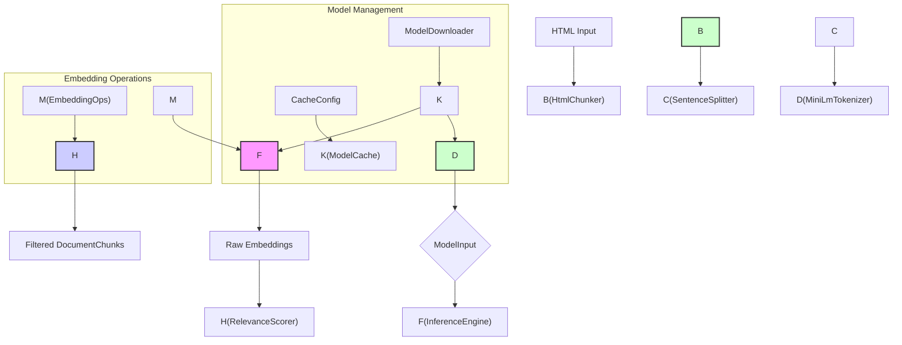

# AI and Machine Learning

# AI and Machine Learning Module

This module provides the core AI and Machine Learning capabilities for the Rust Scraper project, focusing on semantic understanding and processing of web content. It enables features such as semantic chunking, text embedding generation, and relevance-based filtering, forming the foundation for advanced RAG (Retrieval-Augmented Generation) pipelines.

## Core Components

The AI module is composed of several interconnected components, each responsible for a specific aspect of the ML pipeline:

### 1. `CacheConfig` and `ModelCache`

- **Purpose**: Manages the local cache for AI models and related assets.
- **Functionality**:
    - Defines cache directory conventions (XDG compliant).
    - Controls cache validation (SHA256), lifecycle (TTL), and offline mode.
    - Provides methods to ensure cache directory existence, check for cached models, validate integrity, and clear the cache.
- **Integration**: Used by `ModelDownloader` and `SemanticCleanerImpl` to manage model storage.

### 2. `ModelDownloader`

- **Purpose**: Handles the automatic download of AI models from HuggingFace Hub.
- **Functionality**:
    - Downloads specified models and files from a given repository.
    - Supports progress tracking via callbacks.
    - Performs SHA256 validation to ensure download integrity.
    - Includes basic retry logic for network failures.
- **Integration**: Used by `SemanticCleanerImpl` during initialization if `auto_download` is enabled and the model is not found in the cache.

### 3. `InferenceEngine`

- **Purpose**: Executes ONNX models for generating text embeddings.
- **Functionality**:
    - Loads ONNX models using the `tract-onnx` crate.
    - Provides a thread-safe, `Arc`-wrapped inference session for concurrent use.
    - Runs inference asynchronously using `tokio::task::spawn_blocking` to avoid blocking the async runtime.
    - Accepts `ModelInput` (token IDs, attention mask, token type IDs) and returns a fixed-size embedding vector (384 dimensions for `all-MiniLM-L6-v2`).
- **Integration**: The core component for generating embeddings, used by `SemanticCleanerImpl`.

### 4. `MiniLmTokenizer`

- **Purpose**: Tokenizes text into a format suitable for the `all-MiniLM-L6-v2` ONNX model.
- **Functionality**:
    - Implements WordPiece tokenization (BERT-style).
    - Handles special tokens ([CLS], [SEP], [PAD]).
    - Truncates and pads sequences to a maximum length (`DEFAULT_MAX_LENGTH`).
    - Returns `ModelInput` structs, which are directly usable by `InferenceEngine`.
- **Integration**: Used by `SemanticCleanerImpl` to convert text chunks into token IDs before inference.

### 5. `HtmlChunker`

- **Purpose**: Splits raw HTML content into semantically meaningful text chunks.
- **Functionality**:
    - Employs a two-pass approach: structural boundaries (paragraphs) followed by embedding-based refinement (though the current implementation focuses on structural splitting).
    - Strips HTML tags.
    - Splits text into paragraphs and then sentences.
    - Merges small chunks and splits large chunks based on configurable size limits (`min_chunk_size`, `max_chunk_size`).
- **Integration**: The first step in the `SemanticCleanerImpl` pipeline, preparing text for tokenization.

### 6. `SentenceSplitter`

- **Purpose**: Performs Unicode-aware sentence segmentation.
- **Functionality**:
    - Uses the `unicode-segmentation` crate to accurately identify sentence boundaries.
    - Handles various punctuation and edge cases.
    - Provides methods for splitting, trimming, and counting sentences.
- **Integration**: Used internally by `HtmlChunker` for sentence-level splitting.

### 7. `EmbeddingOps`

- **Purpose**: Provides high-performance, SIMD-accelerated operations for vector embeddings.
- **Functionality**:
    - `cosine_similarity`: Computes cosine similarity efficiently using AVX2 SIMD instructions via the `wide` crate. This is crucial for comparing embeddings.
    - `normalize`: Normalizes vectors to unit length.
    - `mean_pool`: Implements mean pooling with attention masking, a standard technique for sentence-transformers models.
    - `l2_normalize_safe`: A safe version of normalization that avoids panics on zero-magnitude vectors.
- **Integration**: Used by `RelevanceScorer` for similarity calculations and by `InferenceEngine` for post-processing embeddings.

### 8. `RelevanceScorer`

- **Purpose**: Filters and ranks text chunks based on their semantic relevance to a reference embedding.
- **Functionality**:
    - Uses `cosine_similarity` (from `EmbeddingOps`) to score chunks against a reference vector.
    - Allows setting a `threshold` to filter out irrelevant chunks.
    - Supports storing a reference embedding internally.
    - Provides methods to filter chunks, filter chunks while preserving embeddings, and find top-k relevant chunks.
- **Integration**: The final filtering stage in the `SemanticCleanerImpl` pipeline.

### 9. `ChunkId`

- **Purpose**: Provides a type-safe identifier for content chunks.
- **Functionality**:
    - A newtype wrapper around `u64` to prevent accidental mixing of chunk IDs with other numerical types.
    - Implements `Display` for human-readable IDs (e.g., "chunk-42").
- **Integration**: Used within `DocumentChunk` and potentially other parts of the system that need to reference specific chunks.

### 10. `SemanticCleanerImpl` (and `ModelConfig`)

- **Purpose**: Orchestrates the entire RAG pipeline for semantic cleaning and filtering.
- **Functionality**:
    - Implements the `SemanticCleaner` trait.
    - Integrates all other components: `HtmlChunker`, `MiniLmTokenizer`, `InferenceEngine`, `RelevanceScorer`.
    - Manages model loading, configuration, and concurrent execution.
    - Handles potential errors throughout the pipeline.
    - Uses `ModelConfig` for customizable pipeline behavior (model repo, cache, max tokens, relevance threshold).
- **Integration**: The main entry point for semantic processing, used by higher-level application logic (e.g., `export_flow.rs`).

## Architecture Overview

The AI module follows a pipeline approach for semantic processing:

**Execution Flow:**

1.  **Chunking**: Raw HTML is passed to `HtmlChunker`, which strips tags and splits the content into semantic `DocumentChunk`s.
2.  **Tokenization**: Each `DocumentChunk`'s text is tokenized by `MiniLmTokenizer` into `ModelInput` (token IDs, attention mask, token type IDs).
3.  **Embedding Generation**: `InferenceEngine` takes the `ModelInput`s and, using the loaded ONNX model, generates embedding vectors for each chunk. This is done concurrently for efficiency.
4.  **Relevance Scoring & Filtering**: `RelevanceScorer` compares the generated embeddings against a reference (or uses a stored reference) using `EmbeddingOps::cosine_similarity`. Chunks are filtered based on a configurable relevance threshold.
5.  **Output**: The final output is a `Vec<DocumentChunk>`, containing only the semantically relevant chunks, with their embeddings preserved.

## Key Design Decisions & Rust Skills Applied

*   **`async`/`await` and `tokio`**: The module extensively uses asynchronous operations for I/O (model loading, file access) and concurrency (`spawn_blocking`, `try_join_all`).
*   **`Arc` for Sharing**: `InferenceEngine`'s session is wrapped in `Arc` to allow thread-safe sharing across multiple concurrent inference requests without expensive cloning.
*   **SIMD Acceleration (`wide` crate)**: `EmbeddingOps` leverages `wide::f32x8` for significant performance gains in vector operations like cosine similarity, especially on CPUs with AVX2 support.
*   **Builder Pattern (`api-builder-pattern`)**: `ModelConfig` uses a builder pattern for flexible and readable configuration.
*   **Type Safety (`type-newtype-ids`)**: `ChunkId` provides compile-time safety for chunk identifiers.
*   **Memory Management (`mem-with-capacity`, `mem-reuse-collections`, `mem-smallvec`)**: Various techniques are employed to optimize memory allocation and reuse, reducing overhead, particularly in tokenization and chunking.
*   **Error Handling (`err-thiserror-lib`, `err-context-chain`)**: Custom `SemanticError` enum and `.context()` calls provide clear and chainable error reporting.
*   **Concurrency Control (`tokio::sync::Semaphore`)**: `SemanticCleanerImpl` uses a semaphore to limit the number of concurrent blocking inference tasks, preventing resource exhaustion on systems with fewer CPU cores.
*   **Model Management**: Follows XDG conventions for cache directories and uses SHA256 for integrity checks.

## Integration with the Codebase

*   **`src/domain/semantic_cleaner.rs`**: Defines the `SemanticCleaner` trait, which `SemanticCleanerImpl` implements.
*   **`src/error.rs`**: Defines the `SemanticError` enum used throughout the module for error propagation.
*   **`src/infrastructure/ai/`**: All core AI components reside within this module.
*   **`src/cli/export_flow.rs`**: The `run_ai_export` function demonstrates how to instantiate and use `SemanticCleanerImpl` for processing scraped content.
*   **`src/application/crawler_service.rs`**: May indirectly use AI features for semantic analysis of discovered content.