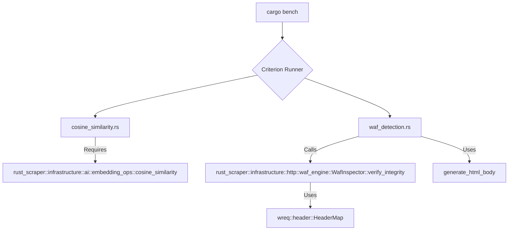

# Benchmarking

# Benchmarking Module

The Benchmarking module provides performance tests for critical components of the `rust-scraper` library. It utilizes the `criterion` crate to measure execution time and throughput for various operations.

## Purpose

The primary goal of this module is to:

*   **Measure performance:** Quantify the speed and efficiency of specific functions and modules.
*   **Identify regressions:** Detect performance degradations introduced by code changes.
*   **Optimize critical paths:** Provide data to guide optimization efforts for performance-sensitive areas.
*   **Validate feature performance:** Ensure that features, especially those with significant computational overhead (like AI embeddings), meet performance expectations.

## Key Components

The benchmarking module consists of several distinct benchmark files, each focusing on a specific area:

### `benches/cosine_similarity.rs`

This benchmark measures the performance of the `cosine_similarity` function, which is part of the AI embedding operations.

*   **Feature Gating:** This benchmark is conditionally compiled using the `ai` feature flag (`#[cfg(feature = "ai")]`). If the `ai` feature is not enabled, a placeholder `main` function is compiled, informing the user that benchmarks require this feature.
*   **Functionality:**
    *   It defines a fixed-size vector (`dims = 384`) for input embeddings.
    *   Deterministic `f32` vectors `a` and `b` are generated using `sin` and `cos` functions to ensure consistent test data.
    *   The `criterion::benchmark_group` is named "cosine\_similarity".
    *   `Throughput::Elements(1)` is set, indicating that each iteration processes one pair of vectors.
    *   The `bench_function` named "simd\_384d" executes the `cosine_similarity` function repeatedly.
    *   `black_box` is used to prevent the compiler from optimizing away the function calls or their arguments.
*   **Dependencies:** Relies on `rust_scraper::infrastructure::ai::embedding_ops::cosine_similarity`.

### `benches/waf_detection.rs`

This benchmark assesses the performance of the `WafInspector::verify_integrity` function, which is responsible for detecting Web Application Firewall (WAF) signatures within HTTP response bodies.

*   **Functionality:**
    *   A helper function `generate_html_body` creates a large HTML string (approximately 500KB) that mimics a typical web page.
    *   This generated body includes several common WAF signature strings interspersed within the HTML content to simulate realistic detection scenarios.
    *   The `criterion::benchmark_group` is named "waf\_detection".
    *   `Throughput::Bytes(body.len() as u64)` is configured, meaning the benchmark measures performance per byte processed.
    *   The `bench_function` named "verify\_integrity\_500kb" calls `WafInspector::verify_integrity` with an empty `HeaderMap` and the generated HTML body.
    *   `black_box` is employed to ensure the integrity of the benchmarked code.
*   **Dependencies:** Relies on `rust_scraper::infrastructure::http::waf_engine::WafInspector` and `wreq::header::HeaderMap`.

## How to Run Benchmarks

To run the benchmarks, you need to have the `criterion` crate as a dev-dependency.

1.  **Build with necessary features:**
    *   For AI-related benchmarks: `cargo bench --features ai`
    *   For WAF detection benchmarks: `cargo bench` (this benchmark does not have feature gates)

2.  **Execution:** The `cargo bench` command will compile and run the benchmarks. Criterion will output detailed performance statistics, including mean execution time, standard deviation, and throughput. It also generates an HTML report in the `target/criterion/report` directory for interactive analysis.

## Module Structure and Dependencies

The benchmarking module is located in the `benches/` directory. Each `.rs` file within this directory represents a separate benchmark suite.

This diagram illustrates the basic flow: `cargo bench` invokes the Criterion runner, which then executes the individual benchmark files. These files, in turn, call specific functions from the `rust-scraper` library's infrastructure layer. The `cosine_similarity` benchmark is conditionally compiled based on the `ai` feature.