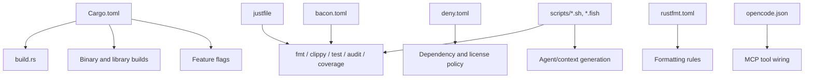

# Build and Scripting

# Build and Scripting

This module is the repository’s build- and workflow-support layer. It does not implement scraping logic itself; instead, it defines how the project is compiled, verified, formatted, tested, audited, and supported in day-to-day development and CI.

It spans several top-level files and scripts:

- `Cargo.toml` for package metadata, dependencies, feature flags, and cargo profiles
- `build.rs` for build-time metadata generation
- `bacon.toml` for editor/watch-driven development jobs
- `justfile` for repeatable local and CI tasks
- `deny.toml` for dependency and license policy
- `rustfmt.toml` for formatting policy
- `scripts/coverage.sh` for coverage generation
- `scripts/dev.sh` for watch-based development
- `scripts/gen_context.fish` for generating the agent context map
- `opencode.json` for local MCP tool wiring

## Responsibilities

The build and scripting layer is responsible for:

- declaring the crate’s compilation and feature topology
- enabling reproducible builds and optimized release artifacts
- generating build metadata at compile time
- standardizing developer workflows for format, lint, test, audit, and coverage
- enforcing dependency and license constraints
- integrating project tooling such as `bacon`, `just`, `cargo-deny`, `cargo-nextest`, and coverage tools
- generating auxiliary files used by agents and editor tooling

## Package metadata and crate configuration

The `Cargo.toml` file is the authoritative source for crate identity and build configuration.

### Package identity

The crate is published as:

- `name = "rust_scraper"`
- `version = "1.1.0"`
- `edition = "2021"`
- `rust-version = "1.88"`

It is positioned as a production-ready web scraper with Clean Architecture, TUI selector support, and sitemap support.

### Feature flags

The crate defines several feature groups:

- `images` and `documents` enable optional MIME detection via `mimetype-detector`
- `full` enables both `images` and `documents`
- `ai` gates the semantic-cleaning stack, including:
  - `tokenizers`
  - `async-trait`
  - `unicode-segmentation`
  - `smallvec`
  - `wide`
  - `tract-onnx`
  - `hf-hub`
- `console` enables `console-subscriber` for tokio-console integration

These features are used to keep the default build light while allowing opt-in functionality for richer processing or observability.

### Dependency layout

The dependency list reflects the project’s architecture and runtime needs:

- CLI and configuration:
  - `clap`
  - `toml`
  - `inquire`
  - `clap_complete`
- Networking and HTTP:
  - `wreq`
  - `wreq-util`
  - `redis`
- Async runtime and concurrency:
  - `tokio`
  - `futures`
  - `dashmap`
  - `governor`
  - `num_cpus`
- Parsing and transformation:
  - `scraper`
  - `lol_html`
  - `legible`
  - `htmd`
  - `pulldown-cmark`
  - `regex`
  - `quick-xml`
- Serialization and metadata:
  - `serde`
  - `serde_json`
  - `serde_yaml`
  - `chrono`
  - `uuid`
  - `url`
- Observability:
  - `tracing`
  - `tracing-subscriber`
  - `tracing-appender`
  - `opentelemetry`
  - `tracing-opentelemetry`
  - `console-subscriber` behind the `console` feature
- Security and portability:
  - `rustls-webpki`
  - `time`
  - `secrecy`
  - `static_assertions`
- Build-time metadata:
  - `built` in `[build-dependencies]`

Several comments in `Cargo.toml` document deliberate version pinning to avoid dependency conflicts, especially around transitive crates such as `dashmap`, `quick-xml`, and `hf-hub`.

### Cargo profiles

The build profiles are tuned for the project’s development and release workflow:

- `profile.dev`
  - `opt-level = 0`
  - `debug = true`
  - dependency packages under `profile.dev.package."*"` use `opt-level = 3`
- `profile.release`
  - `opt-level = 3`
  - `lto = "fat"`
  - `codegen-units = 1`
  - `panic = "abort"`
  - `strip = true`
- `profile.bench`
  - inherits from release
  - keeps debug info
  - does not strip symbols

This gives fast edit/compile iteration in development while still optimizing dependency code, and produces compact, high-performance release binaries.

## Build script: `build.rs`

The build script is intentionally small and focused.

### What it does

`build.rs` performs two actions:

1. emits `cargo:rerun-if-changed=build.rs`
2. calls `built::write_built_file()`

The second step generates build-time metadata that can be embedded into the crate, typically for version strings or diagnostics.

### Behavior and implications

Because the script only depends on `build.rs` itself, Cargo will rerun it when the build script changes. The actual metadata generation is delegated to the `built` crate, which collects information such as:

- package version
- git metadata
- build timestamp
- compiler/build environment details, depending on crate configuration

This keeps build logic out of the main codebase while still making build metadata available to the application.

## Development automation: `bacon.toml`

`bacon.toml` configures a tight feedback loop for interactive development.

### Default job

- `default_job = "clippy"`

Starting the watcher runs Clippy first, which makes lint feedback the primary development signal.

### Key bindings

Useful shortcuts are defined for terminal-driven workflow:

- `c` → `job:clippy`
- `t` → `job:nextest`
- `n` → `job:nextest`
- `d` → `job:doc`
- `r` → `job:run`

### Jobs

The defined jobs map to common Cargo tasks:

- `clippy`
- `nextest`
- `test`
- `doc`
- `doc-open`
- `run`
- `check`
- `check-all`

The `run` job is marked `background = true`, which is useful for keeping the application running while still allowing bacon to monitor output and errors.

### Summary mode

`summary = true` reduces terminal I/O, which is especially useful on slower disks or in highly iterative workflows.

## Task automation: `justfile`

The `justfile` is the main developer-facing task runner for the repository. It complements `bacon` by covering both local and CI-oriented workflows.

## Verification tasks

### `check`

Runs:

- `cargo fmt --check`
- `cargo clippy --all-targets --all-features -- -D warnings ...`

This is the main formatting-and-lint gate. It also adds many Clippy allowance flags to match the codebase’s current refactoring posture.

### `check-fast`

Runs:

- `cargo check`

This is the lightweight compile-only gate.

## Testing tasks

### `test-dev`

Runs targeted tests with `cargo nextest run` using the `dev` profile and limited parallelism.

### `test`

Runs the full suite with `cargo nextest run` using the `agent` profile and `$(nproc)` test threads.

### `test-filter <filter>`

Runs a filtered subset of tests with an `-E` expression. This is useful when a change is localized.

### `test-ai`

Runs tests with `--features ai`, which exercises the semantic-cleaning feature stack.

## Audit and maintenance tasks

### `audit`

Runs:

- `cargo audit`
- `cargo deny check`
- `cargo machete`

This is the dependency health gate.

### `fix-typos`

Runs `typos -w` to auto-fix spelling issues.

## Coverage task

### `cov`

Runs:

- `cargo llvm-cov --html --output-dir coverage-llvm`

This generates HTML coverage output through LLVM-based coverage tooling.

## Build task

### `build-release`

Runs:

- `cargo build --release`

This is the standard release artifact build.

## Setup task

### `setup`

Verifies that common tooling is installed:

- `cargo-nextest`
- `just`
- `cargo-machete`
- `cargo-audit`
- `cargo-deny`
- `typos`
- `sccache`
- `mold`

This is useful for onboarding and for CI/workstation readiness checks.

## Watch and CI workflows

The `justfile` defines two important workflow layers:

- watch-mode helpers:
  - `watch-dev`
  - `test-dev-with-impact`
- CI gates:
  - `test-ci`
  - `test-ci-quick`

`test-ci` is the strict pre-commit/pre-PR gate. It runs:

1. `cargo fmt --all -- --check`
2. strict Clippy
3. `gitnexus analyze`
4. `cargo nextest run --profile ci --test-threads 2 --no-fail-fast`

`test-ci-quick` skips formatting but still runs Clippy, GitNexus analysis, and the CI test profile.

## Dependency policy: `deny.toml`

`deny.toml` establishes the project’s supply-chain policy.

### Advisories

The `[advisories]` section explicitly ignores a small set of known advisories, including transitive issues without safe upgrades and an optional `console-subscriber`-related advisory.

### License allowlist

The `[licenses]` section permits a controlled set of licenses, including:

- MIT
- Apache-2.0
- BSD variants
- ISC
- Unicode licenses
- MPL-2.0
- OpenSSL
- Zlib
- LGPL-3.0

The comment beside LGPL-3.0 notes that it is present through `wreq-util`.

### Bans and sources

- `multiple-versions = "warn"` allows the build to proceed while surfacing duplication warnings
- unknown registries and git sources are warned about rather than hard-failed

This is a practical balance between strictness and the realities of transitive dependency graphs.

## Formatting policy: `rustfmt.toml`

The formatting configuration is straightforward and stable-only:

- `max_width = 100`
- `tab_spaces = 4`
- `hard_tabs = false`
- `reorder_imports = true`
- `use_field_init_shorthand = true`
- `match_block_trailing_comma = true`

These settings make formatting deterministic and keep diffs readable.

## Coverage script: `scripts/coverage.sh`

This shell script wraps LLVM coverage generation.

### Flow

1. verify `cargo-llvm-cov` is installed
2. run `cargo llvm-cov --html --output-dir coverage-llvm --lcov`
3. print the output location
4. print a summary via `cargo llvm-cov --summary-only`

### Notes

- It exits on the first error due to `set -e`
- It is optimized for fast coverage generation compared to heavier tooling
- It emits HTML output under `coverage-llvm/`

## Development watch script: `scripts/dev.sh`

This script is a lightweight manual alternative to `bacon`.

### Flow

1. verify `cargo-nextest` and `cargo-watch` are installed
2. start `cargo watch`
3. on changes, run Clippy and `cargo nextest run --test-threads 2`

### Intended use

This is useful for shell-based development sessions where a simple, explicit watch loop is preferred over terminal UI tooling.

## Agent context generation: `scripts/gen_context.fish`

This Fish script generates `.github/context_map.json`, which appears to be used by AI/agent tooling to understand repository structure.

### Output format

The generated JSON includes:

- project name
- UTC timestamp
- architecture label
- the architectural layers:
  - `Domain`
  - `Application`
  - `Infrastructure`
  - `Adapters`
- entry points:
  - `src/lib.rs`
  - `src/main.rs`
- critical paths for the architecture

### Behavior

The script writes the file directly, then marks it executable with `chmod +x`.

### Practical purpose

This is not part of the runtime application. It supports external tooling that needs a compact map of the repository’s structure and entry points.

## MCP configuration: `opencode.json`

`opencode.json` registers local MCP servers for agent tooling.

### Registered tools

- `gitnexus`
  - launched via `gitnexus mcp`
- `rust_scraper`
  - launched from `target/release/examples/mcp_server_stdio`

### Purpose

This file is consumed by OpenCode-style tooling so the repository can expose local context and project-specific capabilities to an AI agent or editor integration.

## How these files fit together

The build and scripting layer provides the operating envelope for the codebase:

## Extending this module

When modifying build or scripting behavior:

- update `Cargo.toml` first when adding dependencies, features, or profile changes
- keep `build.rs` minimal; move complex build logic into crates when possible
- add new developer tasks to `justfile` when they need repeatable manual execution
- mirror important tasks in `bacon.toml` if they should be available in watch mode
- keep `deny.toml` in sync with dependency and license policy changes
- update `rustfmt.toml` only for project-wide formatting choices
- treat shell scripts as thin wrappers around Cargo and tooling commands

## Contribution guidelines for build tooling

- avoid introducing redundant or conflicting version pins unless necessary
- preserve comments explaining deliberate dependency duplication or pinning
- prefer reproducible, explicit commands over implicit environment behavior
- keep automation scripts short, composable, and easy to audit
- ensure new tasks fail clearly when required external tools are missing

## Summary

This module is the project’s build-and-automation backbone. It does not implement scraping features, but it strongly shapes how the codebase is compiled, validated, observed, and maintained. Most changes here affect the entire repository, so updates should be made carefully and with an eye toward reproducibility, developer experience, and CI consistency.