# Core Application Logic — application

# Core Application Logic — application

This module contains the core application logic, acting as the orchestrator for various scraping and data processing tasks. It defines the application's use cases, dependency injection container, and core services.

## Purpose

The `application` module is responsible for:

1.  **Dependency Injection**: Providing a centralized `Container` to manage and wire up all services and their dependencies, adhering to Clean Architecture principles.
2.  **Core Use Cases**: Implementing high-level functionalities such as crawling websites (`crawler_service`), scraping individual URLs (`scraper_service`), managing crawl results (`crawl_result_repository`), and handling data export (`export_factory`, `export_utils`).
3.  **Cross-Cutting Concerns**: Managing shared concerns like rate limiting (`rate_limiter`), URL deduplication (`deduplicator`), and communication channels (`results_channel`).
4.  **Configuration and State**: Holding application-level configurations and managing state for features like resume mode.

## Key Components

### 1. Dependency Injection Container (`container.rs`)

The `Container` struct serves as the application's dependency injection container. It holds instances of various services and configurations, ensuring they are created once and reused throughout the application.

*   **`Container::new(...)`**: Initializes the container by creating instances of infrastructure services like `HttpClient` and `CrawlResultRepositoryImpl`.
*   **`http_client`**: An `Arc<HttpClient>` for making HTTP requests.
*   **`state_store`**: An optional `Arc<StateStore>` used for resume functionality.
*   **`crawl_result_repo`**: An optional `Arc<dyn CrawlResultRepository>` that uses an append-only log for storing crawl results.

### 2. Crawl Result Repository (`crawl_result_repository.rs`)

Implements the `CrawlResultRepository` trait using an append-only log file (`crawl_results.bin`) for persistence and a `DashMap` for an in-memory index (URL -> byte offset).

*   **Storage Format**: `[4 bytes: u32 LE payload_length][N bytes: JSON ScrapedContent][1 byte: \n]`
*   **`CrawlResultRepositoryImpl::new(...)`**: Initializes the repository, spawns a background writer task, and recovers the index from an existing log file.
*   **`recover_index(...)`**: Scans the log file to rebuild the in-memory index.
*   **`save(...)`**: Appends a `ScrapedContent` to the log via an MPSC channel to a background writer. This is the hot path, designed for minimal overhead.
*   **`find_by_url(...)`**: Reads directly from the log file using the offset from the in-memory index for O(1) lookups.
*   **`BackgroundWriter`**: A separate task that handles sequential writes to the log file, preventing lock contention on the main thread.

### 3. Crawler Service (`crawler_service.rs`)

This module contains the primary crawling logic. It's marked as **DEPRECATED** and users are advised to migrate to the newer `application::crawler` module. It provides functions for discovering and scraping URLs, including support for sitemaps and basic rate limiting.

*   **`CrawlState`**: Manages the state of a resumable crawl.
*   **`discover_urls_for_tui(...)`**: Discovers URLs from a website, either via sitemap or by scraping links from a single page. Designed for TUI interaction.
*   **`scrape_urls_for_tui(...)`**: Scrapes a given list of URLs, downloading and extracting content. Uses `buffer_unordered` for concurrency.
*   **`scrape_single_url_for_tui(...)`**: Handles the scraping of a single URL, including HTML cleaning and content extraction using Readability or a fallback.
*   **`crawl_site(...)`**: The legacy function for crawling an entire site, managing tasks, rate limiting, and results collection.
*   **`crawl_with_sitemap(...)`**: Crawls a site using its sitemap, with logic for auto-discovery and handling nested sitemaps.

### 4. Deduplicator (`deduplicator.rs`)

Provides URL deduplication logic, extracted for testability and potential future backend swapping (e.g., Redis).

*   **`UrlDeduplicator` Trait**: Defines the interface for deduplication operations (`is_visited`, `mark_visited`, `check_and_mark`).
*   **`InMemoryDeduplicator`**: An implementation using `Arc<Mutex<HashSet<String>>>` for thread-safe, in-memory deduplication.
*   **`normalize_url(...)`**: A utility function to normalize URLs for consistent comparison (removes trailing slashes, www prefixes, default ports, etc.).
*   **`ResultsCollector`**: A generic collector for accumulating results, designed to avoid `Arc<Mutex<Vec<T>>>` contention by using channels.

### 5. Export Factory (`export_factory.rs`)

Handles the creation of different exporter types based on the desired `ExportFormat`.

*   **`create_exporter(...)`**: Factory function that instantiates `JsonlExporter` or `VectorExporter` based on the `ExportFormat` enum. Supports `Auto` detection.
*   **`create_state_store(...)`**: Initializes a `StateStore` for tracking processed URLs, typically used in resume mode.
*   **`process_results(...)`**: Orchestrates the export process, converting `ScrapedContent` into `DocumentChunkUnvalidated`, validating them, exporting via the chosen exporter, and updating the `StateStore` if resume mode is active.
*   **`domain_from_url(...)`**: Utility to extract the domain name from a URL.

### 6. Rate Limiter (`rate_limiter.rs`)

Implements rate limiting using the `governor` crate, providing a thread-safe mechanism to control request frequency and concurrency.

*   **`RateLimiterConfig`**: Configuration for delay (milliseconds) and concurrency (burst).
*   **`SharedRateLimiter`**: A wrapper around `governor::RateLimiter` using `Arc` for shared access across async tasks.
*   **`RateLimiterBackend`**: Enum to specify `InMemory` or `Redis` (prepared but not fully implemented).
*   **`RateLimiter` Enum**: Acts as a unified interface, potentially using a distributed Redis backend or falling back to `InMemory`.
*   **`until_ready()`**: The core method that asynchronously waits until a request is allowed according to the configured rate limits.

### 7. Results Channel (`results_channel.rs`)

Provides a high-performance, lock-free mechanism for collecting crawl results using Tokio's MPSC (Multi-Producer, Single-Consumer) channels.

*   **`CrawlMessage`**: Enum representing messages sent through the channel (`Success` or `Error`).
*   **`ResultsCollector`**: Manages the MPSC channel. It holds the sender (`tx`) which is cloned for worker tasks, and spawns a dedicated receiver task that owns the final `Vec<DiscoveredUrl>`.
*   **`is_full(...)`**: Atomically checks if the maximum number of pages has been reached without requiring a lock.
*   **`collect()`**: Consumes the channel, waits for the receiver task to finish, and returns the collected results.

### 8. Scraper Service (`scraper_service.rs`)

This module contains the core logic for scraping a single URL, including fetching HTML, cleaning it, extracting content using Readability, downloading assets, and performing basic SPA detection.

*   **`detect_spa_content(...)`**: Analyzes extracted content and raw HTML to heuristically detect if a page is a Single Page Application (SPA) that might require JavaScript rendering.
*   **`scrape_with_readability(...)`**: A convenience function to scrape a URL using the Readability algorithm with default configurations.
*   **`scrape_with_config(...)`**: The main function for scraping a URL. It handles:
    *   Fetching HTML using `wreq::Client`.
    *   Checking HTTP status codes and network errors.
    *   Logging HTML size (truncated for large bodies).
    *   Detecting WAF/CAPTCHA challenges.
    *   Cleaning HTML boilerplate using `html_cleaner`.
    *   Extracting content using `readability::parse` or `fallback::extract_text`.
    *   Performing SPA detection.
    *   Downloading assets if enabled via `ScraperConfig`.
    *   Returning `ScrapedContent`.

## Execution Flow Example: Crawling a Site

A typical crawl operation might involve the following flow:

1.  **Initialization**: The `Container` is created, initializing services like `HttpClient`, `CrawlResultRepositoryImpl`, and `SharedRateLimiter`.
2.  **Crawl Start**: `crawl_site` (or `crawl_with_sitemap`) is called with a `CrawlerConfig`.
3.  **URL Discovery**: Seed URLs are added to a queue (`UrlQueue` or `VecDeque`). If using sitemaps, `crawl_with_sitemap` is invoked.
4.  **Task Spawning**: The main loop spawns worker tasks up to the configured `concurrency` limit. Each task:
    *   Acquires a permit from the `SharedRateLimiter` (`until_ready()`).
    *   Fetches a URL using `fetch_url` (which internally uses `HttpClient`).
    *   If successful, extracts links using `extract_links`.
    *   Normalizes and filters discovered links using `normalize_url` and `is_allowed`.
    *   Adds valid, unvisited internal links back to the URL queue.
    *   Sends `CrawlMessage::Success` to the `ResultsCollector`.
    *   Handles errors by sending `CrawlMessage::Error` and incrementing an error counter.
5.  **Result Collection**: The `ResultsCollector` receives messages via its MPSC channel. A dedicated receiver task accumulates results.
6.  **Completion**: Once the URL queue is empty and all tasks are joined, `ResultsCollector::collect()` is called to retrieve all gathered `DiscoveredUrl` entries.
7.  **Export**: The collected URLs might then be passed to `scrape_urls_for_tui` or `scrape_with_config` for detailed scraping, and finally processed by `process_results` for export.

## Mermaid Diagram (Conceptual)

```mermaid
graph TD
    subgraph Application Layer
        A[Container] --> B_HttpClient["B(HttpClient)"];
        A --> C_CrawlResultRepositoryImpl["C(CrawlResultRepositoryImpl)"];
        A --> D_SharedRateLimiter["D(SharedRateLimiter)"];
        A --> E_ResultsCollector["E(ResultsCollector)"];
        A --> F_CrawlerService["F(CrawlerService)"];
        A --> G_ScraperService["G(ScraperService)"];
        A --> H_ExportFactory["H(ExportFactory)"];
        A --> I_Deduplicator["I(Deduplicator)"];

        F --> J_fetch_url["J(fetch_url)"];
        F --> K_extract_links["K(extract_links)"];
        F --> L_normalize_url["L(normalize_url)"];
        F --> M_is_allowed["M(is_allowed)"];
        F --> E;
        F --> D;

        G --> N_readability__parse["N(readability::parse)"];
        G --> O_fallback__extract_text["O(fallback::extract_text)"];
        G --> P_download_assets_if_enabled["P(download_assets_if_enabled)"];
        G --> Q_detect_spa_content["Q(detect_spa_content)"];
        G --> R_WafInspector["R(WafInspector)"];

        C --> S_BackgroundWriter["S(BackgroundWriter)"];

        H --> T_create_exporter["T(create_exporter)"];
        H --> U_process_results["U(process_results)"];
        H --> V_create_state_store["V(create_state_store)"];
    end

    subgraph Domain Layer
        B --> W_HttpClientConfig["W(HttpClientConfig)"];
        C --> X_CrawlResultRepository["X(CrawlResultRepository)"];
        C --> Y_ScrapedContent["Y(ScrapedContent)"];
        F --> Z_CrawlerConfig["Z(CrawlerConfig)"];
        F --> AA_DiscoveredUrl["AA(DiscoveredUrl)"];
        F --> AB_CrawlResult["AB(CrawlResult)"];
        G --> AC_ScraperConfig["AC(ScraperConfig)"];
        G --> AD_ScrapedContent["AD(ScrapedContent)"];
        G --> AE_ValidUrl["AE(ValidUrl)"];
        G --> AF_DownloadedAsset["AF(DownloadedAsset)"];
        H --> AG_Exporter["AG(Exporter)"];
        H --> AH_ExporterConfig["AH(ExporterConfig)"];
        H --> AI_ExportFormat["AI(ExportFormat)"];
        H --> AJ_StateStore["AJ(StateStore)"];
        I --> AK_UrlDeduplicator["AK(UrlDeduplicator)"];
        E --> AL_CrawlMessage["AL(CrawlMessage)"];
        E --> AA;
        D --> AM_RateLimiterConfig["AM(RateLimiterConfig)"];
    end

    subgraph Infrastructure Layer
        B --> AN_http["AN(http)"];
        C --> AO_repositories["AO(repositories)"];
        C --> AP_storage["AP(storage)"];
        F --> AQ_crawler["AQ(crawler)"];
        F --> AR_http["AR(http)"];
        G --> AS_scraper["AS(scraper)"];
        G --> AT_converter["AT(converter)"];
        G --> AU_http["AU(http)"];
        G --> AV_waf_engine["AV(waf_engine)"];
        C --> AW_dashmap["AW(dashmap)"];
        C --> AX_tokio__sync__mpsc["AX(tokio::sync::mpsc)"];
        H --> AY_export["AY(export)"];
        H --> AZ_state_store["AZ(state_store)"];
        I --> BA_tokio__sync__Mutex["BA(tokio::sync::Mutex)"];
        E --> BB_tokio__sync__mpsc["BB(tokio::sync::mpsc)"];
        D --> BC_governor["BC(governor)"];
    end

    %% Connections between layers
    B -- uses --> AN;
    C -- implements --> AO;
    C -- uses --> AP;
    F -- uses --> AQ;
    F -- uses --> AR;
    G -- uses --> AS;
    G -- uses --> AT;
    G -- uses --> AU;
    G -- uses --> AV;
    C -- uses --> AW;
    C -- uses --> AX;
    H -- uses --> AY;
    H -- uses --> AZ;
    I -- uses --> BA;
    E -- uses --> BB;
    D -- uses --> BC;

    %% Domain entities used by Application components
    AA -- used by --> F;
    AD -- used by --> G;
    AE -- used by --> G;
    AF -- used by --> G;
    Y -- used by --> C;
    Y -- used by --> G;
    AB -- used by --> F;
    AG -- used by --> H;
    AH -- used by --> H;
    AI -- used by --> H;
    AJ -- used by --> H;
    AK -- used by --> I;
    AL -- used by --> E;
    X -- used by --> C;
    Z -- used by --> F;
    AC -- used by --> G;
    AM -- used by --> D;
    W -- used by --> B;
    AX -- used by --> C;
    BB -- used by --> E;
    BA -- used by --> I;
    BC -- used by --> D;
```

