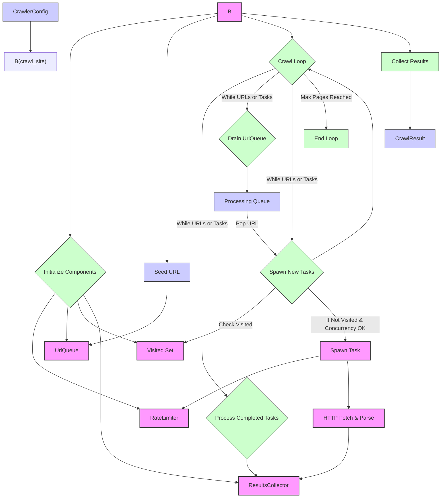

# Crawling Engine

# Crawling Engine

The Crawling Engine module is responsible for the core logic of discovering and fetching web pages. It orchestrates the crawling process, managing concurrency, rate limiting, and the collection of discovered URLs. This module acts as the central hub for initiating and controlling web crawls.

## Purpose

The primary purpose of the Crawling Engine is to:

1.  **Manage the crawl lifecycle:** Initiate a crawl from a seed URL, manage the queue of URLs to visit, and terminate the crawl when conditions are met (e.g., max pages, max depth).
2.  **Handle concurrency:** Spawn and manage multiple crawling tasks concurrently to improve efficiency.
3.  **Integrate with rate limiting:** Ensure that crawling respects the defined rate limits to avoid overwhelming target servers.
4.  **Collect results:** Gather information about visited pages, including successful fetches and errors.
5.  **Deduplicate URLs:** Maintain a record of visited URLs to prevent redundant crawling.

## Key Components

The Crawling Engine is composed of several key components:

### `crawl_site` Function

This is the main entry point for initiating a crawl. It takes a `CrawlerConfig` as input and orchestrates the entire crawling process.

*   **Initialization:** Sets up logging spans, clones the configuration for safe sharing across asynchronous tasks, and initializes essential components like the rate limiter, URL queue, visited set, and results collector.
*   **Seeding:** Adds the initial seed URL to the URL queue.
*   **Crawl Loop:** Enters a loop that continues as long as there are URLs in the queue or active crawling tasks.
    *   **Task Management:** Manages a `tokio::task::JoinSet` to track active crawling tasks.
    *   **Queue Processing:** Drains URLs from the internal `UrlQueue` and adds them to a `VecDeque` for processing.
    *   **Task Spawning:** For each URL, it checks if it has been visited. If not, it spawns a new asynchronous task to handle the crawling of that URL. This task respects the concurrency limits and integrates with the rate limiter.
    *   **Result Collection:** Processes results from completed tasks and updates the `ResultsCollector`.
*   **Termination:** Breaks the loop when the maximum number of pages is reached or when both the URL queue and active tasks are exhausted.
*   **Finalization:** Collects all results and returns a `CrawlResult`.

### `UrlQueue`

A thread-safe queue specifically designed for managing URLs during the crawling process.

*   **Concurrency:** Uses `tokio::sync::Mutex` to protect the internal `Vec<DiscoveredUrl>` for thread-safe access.
*   **Deduplication:** Integrates with a `DashSet<String>` to keep track of URLs that have been added to the queue or already visited, preventing duplicate entries.
*   **Operations:** Provides methods for `push`ing new URLs, `pop_front`ing URLs to be processed, and `drain_all`ing all pending URLs.

## Execution Flow

The `crawl_site` function orchestrates the following high-level flow:

1.  **Setup:** Initialize configuration, rate limiter, URL queue, visited set, and results collector.
2.  **Seed:** Add the starting URL to the queue.
3.  **Loop:**
    *   Check if the maximum page limit has been reached.
    *   Process any completed crawling tasks.
    *   Transfer URLs from the internal `UrlQueue` to the main processing queue.
    *   For each URL in the processing queue:
        *   Check if the URL has already been visited.
        *   If not visited and concurrency limits allow, spawn a new crawling task.
        *   The spawned task will acquire a permit from the rate limiter before proceeding.
4.  **Termination:** Exit loop when the queue is empty and no tasks are running, or when the page limit is hit.
5.  **Result Aggregation:** Collect and return the final crawl results.



## Integration with Other Modules

*   **`application::crawler::discovery`:** The `crawl_site` function relies on discovery mechanisms (like `crawl_with_sitemap`) to populate the initial URL queue and to process discovered URLs from fetched pages.
*   **`application::rate_limiter`:** The engine integrates directly with `SharedRateLimiter` to ensure requests are made at an appropriate pace.
*   **`application::results_channel`:** The `ResultsCollector` is used to gather the outcomes of individual page fetches.
*   **`domain::CrawlerConfig`:** The entire crawling process is configured by `CrawlerConfig`, which dictates seed URLs, depth, concurrency, rate limits, and more.
*   **`infrastructure::crawler::http_client`:** While the engine itself doesn't perform HTTP requests directly, the tasks it spawns will use `fetch_url` to get page content.
*   **`infrastructure::crawler::sitemap_parser`:** The `crawl_site` function can be configured to use sitemaps, which are parsed by this module.

## Usage

The primary way to use the Crawling Engine is by calling the `crawl_site` function with a `CrawlerConfig`:

```rust
use rust_scraper::domain::CrawlerConfig;
use rust_scraper::application::crawler::crawl_site;

#[tokio::main]
async fn main() -> Result<(), Box<dyn std::error::Error>> {
    let config = CrawlerConfig {
        seed_url: "https://example.com".to_string(),
        max_depth: 3,
        max_pages: 1000,
        concurrency: 10,
        delay_ms: 500,
        timeout_secs: 30,
        include_patterns: vec![],
        exclude_patterns: vec![],
        // ... other fields
    };

    match crawl_site(config).await {
        Ok(crawl_result) => {
            println!("Crawl finished successfully. Total pages: {}", crawl_result.total_pages);
            // Process crawl_result.results
        }
        Err(crawl_error) => {
            eprintln!("Crawl failed: {:?}", crawl_error);
        }
    }

    Ok(())
}
```