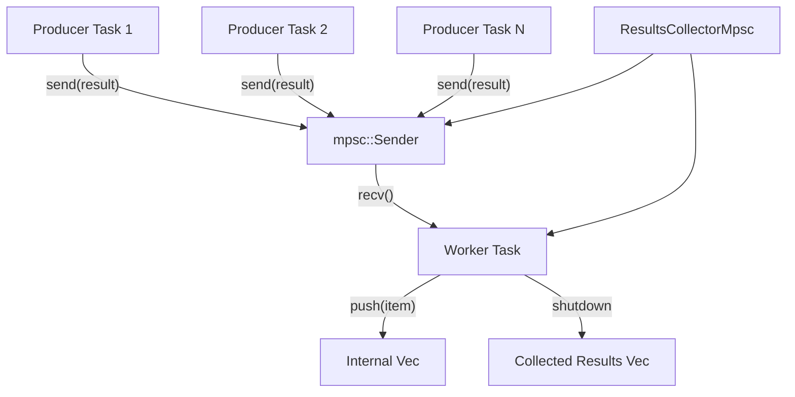

# Documentation and Examples — mpsc-channel-refactor

# mpsc-channel-refactor Module

This module explores and proposes a refactoring of the `ResultsCollector` in `src/application/deduplicator.rs` from an `Arc<Mutex<Vec<T>>>` to an asynchronous multi-producer, single-consumer (mpsc) channel pattern. The primary motivation is to eliminate lock contention that occurs when multiple tasks concurrently write results to the collector.

## Motivation and Problem Statement

The current implementation of `ResultsCollector<T>` uses `Arc<Mutex<Vec<T>>>` to store collected results. This approach suffers from significant lock contention in high-concurrency scenarios, particularly within `crawler_service.rs`.

**Key areas of contention:**

*   **`max_pages` check (read):** Multiple tasks might attempt to read the current count while others are writing.
*   **`DiscoveredUrl` push (write):** Asynchronous tasks pushing results into the collector frequently contend for the mutex.
*   **Final result collection (read/write):** Gathering all results at the end also involves locking.

The project already utilizes `tokio::sync::mpsc` for other communication needs (e.g., `ScrapeProgress` in the TUI, application events), demonstrating its suitability for asynchronous data transfer and backpressure.

## Proposed Solution: mpsc Channel with Dedicated Worker

The recommended approach is to replace the `Arc<Mutex<Vec<T>>>` with an mpsc channel and a dedicated worker task.

### Design Overview

A new `ResultsCollectorMpsc<T>` struct will be introduced. It will hold an `mpsc::Sender<T>` to allow producers to send results and a `tokio::task::JoinHandle` to manage the worker task responsible for collecting these results.

### Key Components

1.  **`ResultsCollectorMpsc<T>`:**
    *   Contains `tx: mpsc::Sender<T>` for sending results.
    *   Holds `worker_handle: tokio::task::JoinHandle<Vec<T>>` to manage the worker task.

2.  **Constructor (`new(capacity: usize)`):**
    *   Creates an mpsc channel with a specified `capacity`.
    *   Spawns a dedicated worker task.
    *   The worker task continuously receives items from the channel (`rx.recv().await`).
    *   Received items are collected into an internal `Vec<T>`.
    *   The worker task terminates when the sender (`tx`) is dropped and the channel is closed.
    *   Returns the `ResultsCollectorMpsc` instance.

3.  **`add(&self, result: T)`:**
    *   Sends the `result` to the worker task via the `tx` sender.
    *   Uses `self.tx.send(result).await.ok()` to handle potential send errors gracefully (e.g., if the receiver has already been dropped). This operation will naturally provide backpressure if the channel is full.

4.  **`shutdown(self) -> Vec<T>`:**
    *   Explicitly drops the `tx` sender, signaling to the worker task that no more messages will be sent.
    *   Awaits the `worker_handle` to complete.
    *   Returns the collected `Vec<T>` from the worker task.

### Integration into `crawler_service.rs`

*   **Initialization:** Replace `Arc::new(Mutex::new(Vec::new()))` with the creation of an mpsc channel and spawning of a dedicated worker task.
*   **Sending Results:** In asynchronous tasks, use `tx.send(discovered_url_task).await.ok()` to send results to the worker.
*   **`max_pages` Check:** This will require a separate mechanism, such as an `Arc<AtomicUsize>`, to track the count of processed items, as `mpsc::channel` does not expose a direct `.len()` method.
*   **Shutdown:** Drop the sender (`tx`) and await the worker task's completion to retrieve the final results.

### Graceful Shutdown Mechanisms

*   **Channel Closure:** The worker task naturally terminates when all `Sender` instances are dropped.
*   **Explicit Shutdown Signal:** The `shutdown` method provides a clear way to signal the end of operations.
*   **Timeouts:** `tokio::time::timeout` can be used if there's a concern about the worker task blocking indefinitely (though this is unlikely with proper sender dropping).

## Alternative Approaches Considered

1.  **Mutex per Operation + Reduce Locking:**
    *   **Description:** Keep `Arc<Mutex<Vec<T>>>` but minimize lock duration. Use `try_lock()` and local batching.
    *   **Pros:** Incremental change, backward compatible API.
    *   **Cons:** Does not eliminate contention entirely, still has potential for blocking.
    *   **Effort:** Low.

2.  **`lockfree::flavors` (e.g., `crossbeam::queue::SegQueue`):**
    *   **Description:** Utilize lock-free data structures.
    *   **Pros:** High performance, no lock contention.
    *   **Cons:** Adds an external dependency, might be overkill.
    *   **Effort:** Medium.

## Risks and Mitigations

*   **Memory Pressure:** If producers are much faster than the worker and the channel capacity is large, memory usage could increase.
    *   **Mitigation:** Use a reasonable channel `capacity` (e.g., 100-1000).
*   **Deadlock on Shutdown:** If the `Sender` is not dropped before awaiting the worker, the worker might never terminate.
    *   **Mitigation:** Ensure `tx` is dropped before `worker_handle.await`.
*   **Producer Blocking:** `send()` can block producers if the channel is full.
    *   **Mitigation:** Consider using `try_send()` with a fallback (e.g., logging a warning) if immediate sending is critical and blocking is unacceptable.
*   **`max_pages` Count:** The `.len()` method is unavailable on mpsc channels.
    *   **Mitigation:** Use a separate `Arc<AtomicUsize>` for counting.
*   **API Change:** The original `ResultsCollector` is `Clone`, while the proposed `ResultsCollectorMpsc` might not be directly cloneable in the same way.
    *   **Mitigation:** Consider making `ResultsCollectorMpsc` cloneable by wrapping its `tx` in an `Arc`, or maintain both implementations temporarily.

## Affected Files

*   `src/application/deduplicator.rs`: Introduction of `ResultsCollectorMpsc<T>`.
*   `src/application/crawler_service.rs`: Replacement of `Arc<Mutex<Vec<T>>>` with the mpsc channel pattern.
*   `src/domain/result/crawl_result.rs`: Likely no direct changes needed.

## Conclusion

The refactoring to use an mpsc channel with a dedicated worker is the recommended approach. It effectively addresses the lock contention issue, aligns with existing patterns in the project, and provides natural backpressure. Careful implementation of the shutdown sequence and the handling of the `max_pages` count are crucial for a successful migration.