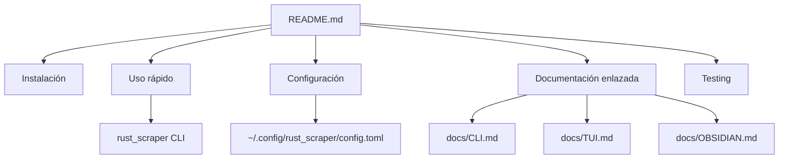

# Documentation and Examples — README.md

# README.md — Documentación y ejemplos

`README.md` es la entrada principal de documentación del proyecto **Rust Scraper**. Describe qué hace la herramienta, cómo instalarla, cómo ejecutar los flujos más comunes y dónde encontrar la documentación especializada del resto del códigobase.

Aunque no contiene lógica ejecutable, este archivo es importante para la experiencia de usuario y para la mantenibilidad del proyecto: define el contrato de uso público del binario `rust_scraper`, resume las capacidades disponibles por features y enlaza a la documentación modular en `docs/`.

## Propósito del proyecto

Rust Scraper es una herramienta de línea de comandos para extraer contenido de sitios web y exportarlo en distintos formatos.

Los objetivos que comunica este README son:

- descargar páginas web con contenido limpio
- facilitar un flujo interactivo para seleccionar URLs
- guardar notas directamente en Obsidian
- usar limpieza semántica con IA para filtrar ruido
- descubrir URLs automáticamente mediante sitemaps
- descargar recursos asociados como imágenes y documentos
- exportar contenido para uso humano o pipelines de datos

## Capacidades principales

El README organiza la propuesta funcional alrededor de estos modos:

### Modo interactivo
Permite explorar URLs, seleccionar cuáles descargar y confirmar la operación antes de iniciar el scraping.

### Exportación a Obsidian
Guarda el contenido directamente en un vault, usando wiki-links y metadatos cuando se activa la integración correspondiente.

### Limpieza con IA
Describe una etapa de filtrado semántico que conserva el contenido relevante e ignora elementos típicamente descartables como menús o publicidad.

### Descubrimiento automático con sitemap
Usa el sitemap del sitio como fuente de URLs para evitar tener que proporcionar manualmente una lista de páginas.

### Descarga de recursos
Incluye soporte para imágenes y documentos como PDFs, DOCX o XLSX.

### Exportación múltiple
Expone los formatos `markdown`, `json`, `jsonl` y `vector`, con usos distintos según si el destino es lectura humana, integración con otras apps o flujos RAG.

## Instalación

El README documenta dos rutas de instalación:

### `cargo install --path . --features "ai,full"`
Esta es la vía recomendada para desarrolladores o usuarios que compilan desde el repositorio.

Puntos importantes documentados aquí:

- compila en modo release
- instala el binario en `~/.cargo/bin/`
- habilita las features `ai` y `full`
- deja disponible el comando `rust_scraper --help`

### Compilación manual
La alternativa manual usa:

```bash
cargo build --release
```

y luego copia el binario desde `target/release/rust_scraper` a un directorio en el `PATH`.

## Dependencias y requisitos operativos

El archivo también fija expectativas de entorno:

- **Rust 1.88 o superior**
- **Linux, macOS o Windows**

Además, documenta un comportamiento importante del modo IA:

- el modelo ONNX local se descarga y cachea automáticamente
- el cache se guarda en `~/.cache/rust_scraper/models/`
- la primera compilación puede tardar varios minutos

## Flujo de uso documentado

El README está pensado como guía de inicio rápido. El flujo central que presenta es:

1. instalar el binario
2. ejecutar `rust_scraper --url https://example.com`
3. obtener resultados en `output/`

También muestra variantes habituales:

- `--use-sitemap` para descubrimiento automático
- ejecución sin `--url` en terminal interactiva
- ejecución con `--interactive` para abrir el TUI
- `--obsidian-wiki-links --quick-save` para exportar a Obsidian
- `--clean-ai --export-format jsonl` para filtrado semántico y exportación orientada a RAG

## Comportamiento de entrada de URL

Una parte importante del README es la documentación del comportamiento automático de entrada:

- en un terminal interactivo, `rust_scraper` puede pedir la URL
- en un pipe, falla con un error que indica que `--url` es obligatorio
- en CI, falla con un error específico para ese modo

Este detalle define una expectativa clave de UX: el binario intenta ser amigable en consola interactiva, pero estricto en contextos no interactivos.

## Interfaz interactiva

El README describe el TUI como una experiencia de selección previa al scraping, con dos fases principales:

- **Selección de URLs**
- **Scraping con progreso y errores en vivo**

También documenta controles de teclado:

- flechas arriba/abajo para navegar
- espacio para alternar selección
- `A` para seleccionar todo
- `D` para deseleccionar todo
- `Enter` para confirmar
- `j` / `k` para scrollear errores
- `q` para salir

Esto es útil para entender que el modo interactivo no es un simple flag, sino un flujo de trabajo completo de revisión antes de ejecutar descargas.

## Formatos de exportación

El README actúa como contrato de salida al enumerar los formatos soportados:

| Formato | Uso principal |
|---|---|
| `markdown` | Lectura humana y documentación |
| `json` | Integración con otras aplicaciones |
| `jsonl` | Pipelines RAG e IA |
| `vector` | Bases de datos vectoriales con embeddings |

Esto orienta a los consumidores del CLI sobre qué formato elegir según su caso de uso.

## Configuración por archivo

Se documenta la existencia de un archivo de configuración en:

```text
~/.config/rust_scraper/config.toml
```

Con ejemplos de valores por defecto como:

```toml
format = "markdown"
max_pages = 50
delay_ms = 500
use_sitemap = true
```

El README deja claro que:

- el archivo sirve para establecer defaults persistentes
- los argumentos de línea de comandos tienen prioridad sobre esa configuración

## Relación con el resto del proyecto

Este archivo funciona como índice de navegación hacia la documentación especializada del repositorio. En particular enlaza a:

- `docs/CLI.md` — referencia completa de opciones
- `docs/TUI.md` — guía del selector interactivo
- `docs/USAGE.md` — ejemplos y troubleshooting
- `docs/OBSIDIAN.md` — integración con Obsidian
- `docs/AI-SEMANTIC-CLEANING.md` — pipeline de limpieza con IA
- `docs/RAG-EXPORT.md` — exportación para RAG y embeddings
- `docs/ARCHITECTURE.md` — diseño interno
- `DEVELOPMENT.md` — guía de contribución
- `CHANGELOG.md` — historial de versiones

En otras palabras, `README.md` es el “front door” del proyecto: presenta la visión general y delega los detalles al resto de la documentación.

## Testing y estado del proyecto

El README también comunica estado de calidad y cobertura:

- 613 tests unitarios pasando
- 18 tests de integración omitidos por depender de red externa
- recomendación de usar `cargo nextest run`
- nota sobre una mejora pendiente: introducir `wiremock` para estabilizar tests de integración

Esto ayuda a quienes contribuyen a entender que la suite principal es estable, pero que parte de la integración todavía depende de infraestructura externa.

## Estructura conceptual



## Consideraciones para contribuir

Al modificar `README.md`, conviene mantener consistencia con:

- los flags reales del CLI
- los nombres exactos del binario y rutas documentadas
- las features activables durante instalación
- la terminología usada en `docs/`
- el comportamiento real de errores, modo interactivo y exportación

Dado que este archivo es la primera referencia para usuarios nuevos, cualquier cambio en el CLI o en las capacidades principales debería reflejarse aquí rápidamente para evitar documentación desalineada.