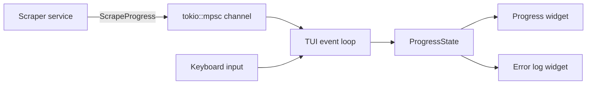

# Documentation and Examples — specs

# Documentation and Examples — specs

The `specs/` directory contains product and implementation specifications that define intended behavior before or alongside code changes. These documents are part of the project’s developer workflow, not runtime code. In this module, the primary specification is `specs/async-reactive-tui.md`, which describes the async progress UI for scraping in the TUI.

## Purpose

`specs/async-reactive-tui.md` captures the requirements for extending the terminal UI from a URL-selection workflow to a live scraping progress workflow. It defines:

- what the user should see while scraping runs
- how progress and errors are reported back to the UI
- the event and state types used to model progress
- the expected async event loop structure using `tokio::select!`
- acceptance criteria and test expectations

This spec is the coordination point between the scraper service, the TUI adapter layer, and the widgets that render progress and error state.

## What this spec covers

The document is focused on the scraping phase of the TUI:

- a progress widget with per-URL state
- an error log widget for live failures
- a unified progress event stream
- a non-blocking event loop that handles user input and scraper updates concurrently

It explicitly excludes:

- URL discovery and selection behavior
- scraping logic changes in the application layer
- export pipeline changes

That separation matters: the spec assumes the scraper already exists and only defines how the TUI observes and presents its work.

## Core concepts defined by the spec

### `ScrapeProgress`

`ScrapeProgress` is the event payload sent from the scraper layer into the TUI over a `tokio::mpsc` channel. It models the lifecycle of a URL scrape:

- `Started`
- `StatusChanged`
- `Completed`
- `Failed`
- `Finished`

This is the bridge between backend work and frontend state. The spec uses it to avoid coupling the TUI directly to scraping internals.

### `ScrapeStatus`

`ScrapeStatus` is the per-URL state machine displayed by the progress widget:

- `Pending`
- `Fetching`
- `Extracting`
- `Downloading`
- `Completed`
- `Failed`

The spec also defines `ScrapeStatus::icon()`, which returns the visual symbol used in the list view.

### `ScrapeError` and `ErrorType`

`ScrapeError` is the internal error representation for failures in scraping. `ScrapeError::error_type()` maps it to an `ErrorType`, and `ScrapeError::message()` turns it into a display-friendly string.

`ErrorType` is designed for UI rendering and classification:

- `Network`
- `Http(u16)`
- `WafBlocked(String)`
- `Parse(String)`
- `Timeout`
- `Connection`
- `Other`

This split lets the UI show both a human-readable message and a structured severity/category.

### `ErrorEntry`

`ErrorEntry` represents one rendered row in the error log widget:

- timestamp
- URL
- error type
- message

The spec uses `chrono::DateTime<Utc>` for ordering and display.

### `ProgressState`

`ProgressState` aggregates the whole scraping batch:

- URL states
- counts for total/completed/failed
- collected errors
- start time
- ETA

It also defines `percentage()` and `update_eta()` as the core derived-state helpers.

### `UrlState`

`UrlState` holds the per-URL UI state:

- `url`
- `status`
- `chars`
- `error`

This is the data structure the progress widget renders line by line.

### `AppEvent`

`AppEvent` is the event union for the TUI loop. It combines:

- keyboard input
- scraper progress
- tick events
- quit signals
- a no-op state

The intent is to keep the event loop logic centralized and avoid separate control paths for input, background work, and animation timing.

## Architecture described by the spec

The module layout proposed by the spec is:

```text
src/adapters/tui/
├── mod.rs
├── terminal.rs
├── url_selector.rs
├── progress_state.rs
├── progress_widget.rs
├── error_log_widget.rs
├── scrape_progress.rs
├── app_event.rs
└── event_loop.rs
```

This reflects a clean split:

- `scrape_progress.rs` defines the shared progress/error enums
- `progress_state.rs` tracks derived batch state
- `progress_widget.rs` renders the batch progress view
- `error_log_widget.rs` renders failures
- `app_event.rs` normalizes event sources
- `event_loop.rs` drives the async TUI loop

The existing terminal setup and URL selection code are intentionally left unchanged.

## Runtime flow implied by the spec

The high-level flow is:

1. the UI discovers URLs
2. the user selects URLs interactively
3. the scraper begins work
4. the scraper sends `ScrapeProgress` messages through a bounded `tokio::mpsc` channel
5. the TUI event loop receives progress updates alongside user input
6. the TUI updates `ProgressState`
7. widgets redraw the current scraping status and errors

The spec requires `tokio::select!` in the event loop so that input and progress updates are handled concurrently without blocking.



## How the spec is intended to be used

This document functions as both a requirements contract and an implementation guide. Contributors should use it to:

- understand what the progress UI must do
- verify the shape of new types before implementing them
- align the scraper service and TUI adapter on event payloads
- derive tests and acceptance checks

If implementation details drift from the spec, the spec should be updated first or in lockstep.

## Implementation constraints encoded in the spec

The document is specific about several engineering choices:

- `tokio::mpsc` is the event transport
- the channel is bounded with capacity 100
- failed sends should be logged but must not fail scraping
- `tokio::select!` drives the event loop
- user input has priority over lower-level rendering ticks
- the tick interval is 100ms
- the error panel defaults to 10 visible entries

These constraints are important because they shape responsiveness and failure behavior. They also make the UI’s concurrency model testable.

## UI behavior defined by the spec

The progress screen is designed around three visible concerns:

- batch completion percentage
- per-URL status and counts
- a live error feed

The visual examples in the spec show:

- a top progress bar with a percentage and ETA
- a URL list with status icons
- a bottom error widget, newest first
- a summary line with completed / remaining / failed counts

The spec also defines the handling of failures:

- failed URLs remain visible
- errors appear quickly in the log
- WAF errors are classified separately from generic HTTP failures
- the UI should continue processing remaining URLs after a failure

## Testing guidance in the spec

The spec includes both unit and integration testing targets.

### Unit-level targets

- `ScrapeStatus::icon()`
- `ScrapeError::error_type()`
- `ScrapeError::message()`
- `ProgressState::percentage()`
- `ProgressState::update_eta()`

### Integration-level targets

- scraping a batch and observing progress updates
- showing errors for failed URLs
- quitting cleanly with `q`
- force-stopping with `Ctrl+C`

The acceptance criteria are written to be directly testable, including responsiveness expectations in milliseconds.

## Example of the intended data flow

A scraper implementation following this spec would emit events like:

```rust
progress_tx.send(ScrapeProgress::Started { url: url.clone() }).await?;
progress_tx.send(ScrapeProgress::StatusChanged {
    url: url.clone(),
    status: ScrapeStatus::Fetching,
}).await?;
progress_tx.send(ScrapeProgress::Completed {
    url: url.clone(),
    chars: 1234,
}).await?;
```

On failure:

```rust
progress_tx.send(ScrapeProgress::Failed {
    url: url.clone(),
    error: ScrapeError::Http(404, "Not Found".into()),
}).await?;
```

The TUI is expected to translate those events into `ProgressState` updates and widget redraws.

## Relationship to the rest of the codebase

This specification sits at the boundary between:

- the scraper service, which produces work and progress events
- the TUI adapter layer, which consumes those events and renders them
- the existing URL selection flow, which precedes scraping

It does not replace implementation code, but it defines the contract that the implementation should satisfy. For contributors, it is the best place to start before modifying the TUI progress path or adding new progress-related event types.

## Notes on scope and future changes

The spec deliberately defers several enhancements:

- animated progress bars
- pause/resume
- retry failed URLs
- per-URL timing
- export during scraping
- multi-select retry workflows

If any of those are added later, they should be introduced as explicit spec updates so the UI behavior, event model, and tests remain aligned.