# Domain Models and Entities

# Domain Models and Entities

This module defines the core domain models and entities used throughout the `rust-scraper` application. It represents the fundamental business types and data structures, adhering to Clean Architecture principles by having no dependencies on infrastructure or external frameworks. This ensures that the core business logic is pure and testable independently.

## Purpose

The primary purpose of this module is to establish a robust and type-safe representation of data relevant to web crawling and content processing. This includes:

*   **Crawl Job Entities**: Representing discovered URLs and their properties.
*   **Credentials**: Securely handling sensitive information like API keys and access tokens.
*   **Document Representation**: Defining how scraped content is structured, validated, and prepared for downstream processing (e.g., RAG pipelines).
*   **Configuration**: Specifying how a crawler should behave for a given site.
*   **Errors**: Defining domain-specific errors for various operations.
*   **Value Objects**: Providing type-safe primitives for URLs, correlation IDs, etc.

## Key Components

The domain layer is organized into several sub-modules, each focusing on a specific aspect of the application's data model:

### `crawl_job`

*   **`ContentType`**: An enum representing the type of content discovered (e.g., `Html`, `Xml`, `Text`).
*   **`DiscoveredUrl`**: A struct representing a URL found during a crawl. It includes the URL itself, its depth in the crawl tree, its parent URL, and its content type.

### `credentials`

This sub-module provides secure handling of sensitive credentials using the `secrecy` crate, ensuring memory is zeroized on drop and secrets are not leaked in debug output.

*   **`ApiKey`**, **`AccessToken`**: Wrappers for API keys and access tokens, providing secure storage and redacted debug output.
*   **`SecretCredential`**: Combines a provider name with a secret and an optional expiry timestamp.
*   **`CredentialStore`**: A collection for managing `SecretCredential` instances, keyed by provider.
*   **`SensitiveString`**: A general-purpose wrapper for sensitive string data.
*   **`CredentialError`**: Enum for errors related to credential operations (e.g., `Expired`, `NotFound`).

### `entities`

This module defines core business entities, particularly focusing on the representation of scraped content and its transformation into document chunks for RAG pipelines.

*   **`ScrapedContent`**: Represents raw data extracted from a web page, including title, content, URL, excerpt, author, date, and downloaded assets.
*   **`DownloadedAsset`**: Metadata about assets (images, documents) downloaded from a page.
*   **`DocumentChunk<S>`**: A generic struct representing a piece of content ready for RAG. It uses a typestate pattern (`Draft`, `Validated`, `Exported`) to enforce a safe workflow:
    *   `Draft`: Initial state after scraping.
    *   `Validated`: State after passing validation checks.
    *   `Exported`: State after being exported.
    *   `DocumentChunkUnvalidated`, `DocumentChunkValidated`, `DocumentChunkExported`: Type aliases for convenience.
*   **`ValidationError`**: Errors that can occur during `DocumentChunk` validation.
*   **`ExportFormat`**: Enum defining supported export formats for RAG pipelines (`Jsonl`, `Vector`, `Auto`).
*   **`ExportState`**: Tracks processed URLs for incremental exports.

### `error`

*   **`CrawlError`**: A comprehensive enum defining various errors that can occur during the crawling process. It follows the `thiserror` pattern for library error types and is designed to be non-exhaustive.

### `exporter`

*   **`Exporter` Trait**: Defines the interface for exporting `DocumentChunk`s to various formats.
*   **`ExporterConfig`**: Configuration struct for exporter instances, specifying output directory, format, filename, and append mode.
*   **`ExporterError`**: Enum for errors related to export operations.

### `js_renderer`

*   **`JsRenderer` Trait**: A forward-compatible stub defining the interface for rendering JavaScript-heavy web pages. No concrete implementation exists yet, but the trait is defined in the domain layer to represent this business capability.
*   **`JsRenderError`**: Error type for JavaScript rendering failures.

### `link_extractor`

*   **`LinkExtractor` Trait**: Defines the contract for extracting links from HTML. Implementations are expected in the infrastructure layer.
*   **`LinkProcessor`**: A struct containing pure functions for link normalization and validation (e.g., `is_internal_link`, `normalize_url`).

### `pattern_matching`

*   **`matches_pattern` function**: A utility for performing SSRF-safe glob-style pattern matching on URL hosts only, not raw URL strings.

### `result`

*   **`CrawlResult`**: Represents the outcome of a crawling operation, containing discovered URLs, total pages crawled, and error counts.

### `site`

*   **`CrawlerConfig`**: Configuration for crawling a specific site, including seed URL, depth limits, patterns, concurrency, and user agent.
*   **`CrawlerConfigBuilder`**: A builder pattern implementation for fluently constructing `CrawlerConfig` instances.

### `url_validation`

*   **`validate_and_parse_url` function**: A utility for strictly validating and parsing URL strings, ensuring they use `http` or `https` schemes and have a valid host.

### `url_validator`

*   **`UrlValidator`**: A service containing pure functions for validating URLs against business rules, such as filtering out specific invalid patterns (e.g., certain Node.js version URLs).

### `value_objects`

*   **`CorrelationId`**: A value object representing W3C TraceContext correlation IDs for distributed tracing, including `trace_id` (UUID v7) and `span_id`.
*   **`ValidUrl`**: A newtype wrapper around `url::Url` that guarantees the URL is valid at the type level, preventing runtime errors from invalid URLs.

## Architecture and Relationships

The domain layer serves as the heart of the application, defining the core business logic and data structures. It is designed to be independent of any external concerns like HTTP clients, databases, or specific file formats.

```mermaid
graph TD
    subgraph Domain Layer
        A[crawl_job] --> B_entities["B(entities)"]
        A --> C_error["C(error)"]
        D[credentials] --> C
        E[entities] --> F_value_objects["F(value_objects)"]
        E --> G_url_validation["G(url_validation)"]
        E --> H_url_validator["H(url_validator)"]
        I[exporter] --> E
        J[js_renderer] --> C
        K[link_extractor] --> C
        L[pattern_matching] --> F
        M[repositories]
        N[result] --> A
        O[site] --> P_crawler_entities["P(crawler_entities)"]
        O --> Q_pattern_matching["Q(pattern_matching)"]
        R[url_validation] --> S_error["S(error)"]
        T[url_validator] --> U_value_objects["U(value_objects)"]
        V[value_objects]
        W[crawler_entities] --> A
        W --> O
        W --> N
        W --> C
        W --> Q
        X[semantic_cleaner] --> E
    end

    subgraph Application Layer
        Y[scraper_service] --> O
        Y --> E
        Y --> K
        Y --> J
        Y --> X
        Y --> N
        Y --> C
        Z[export_factory] --> I
        Z --> E
        AA[url_filter] --> Q
        AA --> H
        AA --> O
        AB[deduplicator] --> G
        AB --> V
    end

    subgraph Infrastructure Layer
        AC[scraper] --> Y
        AC --> K
        AD[http_client] --> C
        AE[asset_download] --> Y
        AF[storage] --> E
        AG[ai] --> X
        AH[headless_chrome] --> J
        AI[link_extractor_impl] --> K
        AJ[repositories_impl] --> M
        AK[url_validation_impl] --> G
        AL[url_validator_impl] --> H
    end

    subgraph CLI/UI Layer
        AM[export_flow] --> Z
        AM --> Y
        AN[crawl_flow] --> Y
        AN --> O
        AO[main] --> AM
        AO --> AN
    end

    B --> V
    C --> C
    F --> F
    G --> V
    H --> G
    I --> I
    J --> J
    K --> K
    L --> L
    M --> M
    N --> N
    O --> O
    P --> P
    Q --> Q
    R --> R
    S --> S
    T --> T
    U --> U
    V --> V
    W --> W
    X --> X
    Y --> Y
    Z --> Z
    AA --> AA
    AB --> AB
    AC --> AC
    AD --> AD
    AE --> AE
    AF --> AF
    AG --> AG
    AH --> AH
    AI --> AI
    AJ --> AJ
    AK --> AK
    AL --> AL
    AM --> AM
    AN --> AN
    AO --> AO

```

*   **Domain Layer**: Contains the core business logic and entities.
*   **Application Layer**: Orchestrates use cases, coordinating domain logic and infrastructure.
*   **Infrastructure Layer**: Provides concrete implementations for interfaces defined in the domain and application layers (e.g., HTTP clients, database access, AI model inference).
*   **CLI/UI Layer**: Handles user interaction and application entry points.

The domain entities are fundamental building blocks used across all layers. For instance, `DocumentChunk` is created in the domain, potentially processed by application services, and then exported using infrastructure implementations. `CrawlerConfig` is used by the application layer to configure crawling tasks, which are then executed by infrastructure components. Errors defined in the domain (`CrawlError`, `ValidationError`) are propagated and handled across layers.