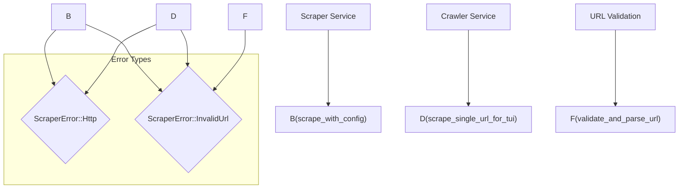

# Error Handling

# Error Handling Module (`rust_scraper::error`)

This module defines the primary error types and the `Result` alias used throughout the `rust_scraper` library. It leverages the `thiserror` crate to provide robust, type-safe, and informative error handling, distinguishing it from more general-purpose error handling crates like `anyhow`.

## Purpose

The goal of this module is to:

*   **Centralize Error Definitions:** Provide a single source of truth for all possible errors that can occur within the `rust_scraper` library.
*   **Enhance Debuggability:** Offer detailed error messages that aid developers in diagnosing and resolving issues.
*   **Enable Granular Error Handling:** Allow calling code to match on specific error variants and implement tailored recovery or reporting strategies.
*   **Facilitate Error Conversion:** Support seamless conversion from underlying library errors (e.g., `std::io::Error`, `url::ParseError`, `serde_json::Error`) into `ScraperError`.

## Core Components

### `ScraperError` Enum

The `ScraperError` enum is the main error type for the library. Each variant represents a distinct failure mode, often wrapping underlying errors or providing specific context.

```rust
#[derive(Error, Debug)]
pub enum ScraperError {
    #[error("URL inválida: {0}")]
    InvalidUrl(String),

    #[error("http error {status} al acceder a {url}")]
    Http {
        status: u16,
        url: String,
    },

    #[error("Error de legibilidad: {0}")]
    Readability(String),

    #[error("Error de I/O: {0}")]
    Io(#[from] std::io::Error),

    #[error("error de red: {0}")]
    Network(String),

    #[error("error de middleware: {0}")]
    Middleware(String),

    #[error("Error de serialización: {0}")]
    Serialization(#[from] serde_json::Error),

    #[error("Error de YAML: {0}")]
    Yaml(#[from] serde_yaml::Error),

    #[error("Error de parseo de URL: {0}")]
    UrlParse(#[from] url::ParseError),

    #[error("Error de extracción: {0}")]
    Extraction(String),

    #[error("Error de descarga: {0}")]
    Download(String),

    #[error("Error de configuración: {0}")]
    Config(String),

    #[error("WAF/CAPTCHA detectado en {url}: {provider}")]
    WafBlocked {
        url: String,
        provider: String,
    },

    #[error("Validación de URL falló: {0}")]
    Validation(String),

    #[error("Error de conversión: {0}")]
    Conversion(String),

    #[error("Error de exportación: {0}")]
    Export(String),

    #[error("extracción falló para {url}: {reason}")]
    ExtractionFailed {
        url: String,
        reason: String,
    },

    #[error("Error de exportación en batch: {0}")]
    ExportBatch(String),

    #[cfg(feature = "ai")]
    #[error("Error de limpieza semántica: {0}")]
    Semantic(#[from] SemanticError),
}
```

**Key Variants and Their Meanings:**

*   **`InvalidUrl(String)`**: The provided URL could not be parsed or is malformed.
*   **`Http { status: u16, url: String }`**: An HTTP request resulted in a non-success status code. Includes the status code and the URL that was requested.
*   **`Readability(String)`**: An error occurred during the content extraction process using the Readability algorithm.
*   **`Io(#[from] std::io::Error)`**: A standard I/O operation failed (e.g., file system access). The `#[from]` attribute allows automatic conversion from `std::io::Error`.
*   **`Network(String)`**: A network-related error occurred (e.g., connection refused, timeout).
*   **`Middleware(String)`**: An error originating from the request middleware, often related to retries or other request pipeline issues.
*   **`Serialization(#[from] serde_json::Error)`**: A JSON serialization or deserialization error.
*   **`Yaml(#[from] serde_yaml::Error)`**: A YAML serialization or deserialization error.
*   **`UrlParse(#[from] url::ParseError)`**: An error during URL parsing, typically from the `url` crate.
*   **`Extraction(String)`**: A general error during asset or content extraction.
*   **`Download(String)`**: An error encountered while downloading an asset.
*   **`Config(String)`**: An issue with the scraper's configuration.
*   **`WafBlocked { url: String, provider: String }`**: A Web Application Firewall (WAF) or CAPTCHA challenge was detected, preventing access to the URL.
*   **`Validation(String)`**: A general URL validation failure.
*   **`Conversion(String)`**: An error during data format conversion (e.g., HTML to Markdown).
*   **`Export(String)`**: An error during an export operation.
*   **`ExtractionFailed { url: String, reason: String }`**: A specific failure during content extraction for a given URL, with a reason provided.
*   **`ExportBatch(String)`**: An error occurred during a batch export operation, potentially indicating partial success.
*   **`Semantic(#[from] SemanticError)`**: (Conditional on `ai` feature) An error related to AI-powered semantic cleaning operations.

### `SemanticError` Enum

This enum, available only when the `ai` feature is enabled, defines errors specific to AI/ML operations like model loading, tokenization, and inference.

```rust
#[cfg(feature = "ai")]
#[derive(Error, Debug)]
pub enum SemanticError {
    #[error("Error cargando modelo ONNX: {0}")]
    ModelLoad(#[from] std::io::Error),

    #[error("Error tokenizando texto: {0}")]
    Tokenize(String),

    #[error("Error ejecutando inferencia ONNX: {0}")]
    Inference(String),

    #[error(
        "Chunk {chunk_id} excede límite de tokens: {tokens} > {max} (modelo: all-MiniLM-L6-v2)"
    )]
    ChunkTooLarge {
        chunk_id: String,
        tokens: usize,
        max: usize,
    },

    #[error("Error descargando modelo '{repo}': {cause}")]
    Download {
        repo: String,
        cause: String,
    },

    #[error("Validación de caché falló para '{repo}': SHA256 inválido (esperado: {expected}, obtenido: {actual})")]
    CacheValidation {
        repo: String,
        expected: String,
        actual: String,
    },

    #[error("Modo offline: modelo '{repo}' no está en caché")]
    OfflineMode {
        repo: String,
    },
}
```

### `Result<T>` Type Alias

A convenient type alias is provided for `std::result::Result<T, ScraperError>`, simplifying function signatures that return a `ScraperError`.

```rust
pub type Result<T> = std::result::Result<T, ScraperError>;
```

### Helper Functions

The `ScraperError` enum includes several `#[must_use]` associated functions to easily construct specific error variants. These functions promote clarity and reduce boilerplate when creating errors.

*   `ScraperError::invalid_url(msg: impl Into<String>) -> Self`
*   `ScraperError::http(status: u16, url: &str) -> Self`
*   `ScraperError::waf_blocked(url: impl Into<String>, provider: impl Into<String>) -> Self`
*   `ScraperError::readability(msg: impl Into<String>) -> Self`
*   `ScraperError::extraction(msg: impl Into<String>) -> Self`
*   `ScraperError::download(msg: impl Into<String>) -> Self`
*   `ScraperError::conversion(msg: impl Into<String>) -> Self`
*   `ScraperError::export(msg: impl Into<String>) -> Self`
*   `ScraperError::export_batch(msg: impl Into<String>) -> Self`

## Integration with the Codebase

The `ScraperError` and its associated `Result` type are fundamental to the library's error handling strategy.

*   **Function Signatures:** Most functions that can fail will return `ScraperError::Result<T>`.
*   **Error Propagation:** The `?` operator is extensively used to propagate errors up the call stack. When an operation returns a `Result` that is an `Err`, the `?` operator will immediately return that error from the current function.
*   **Error Conversion:** The `#[from]` attribute on variants like `Io` and `Serialization` allows for automatic conversion from underlying error types. For other types, explicit `map_err` calls might be used.
*   **Specific Error Handling:** Callers can use `match` statements on `ScraperError` to handle specific failure modes differently. For example, a WAF block might trigger a different user notification than a simple HTTP 404.

### Call Graph and Execution Flows

The `ScraperError` variants, particularly `Http` and `InvalidUrl`, are frequently encountered and handled across various parts of the application.

*   **`Http` and `InvalidUrl`:** These are often generated by lower-level functions responsible for fetching and validating URLs, such as `scrape_with_config` in `scraper_service.rs` and `scrape_single_url_for_tui` in `crawler_service.rs`. The `validate_and_parse_url` function in `url_validation.rs` is a direct source of `InvalidUrl` errors.
*   **Testing:** The included unit tests demonstrate how to create and assert against various `ScraperError` variants, ensuring the error reporting is as expected.



This diagram illustrates how services like `Scraper Service` and `Crawler Service` interact with functions that can produce `Http` and `InvalidUrl` errors, which are defined within the `ScraperError` enum.