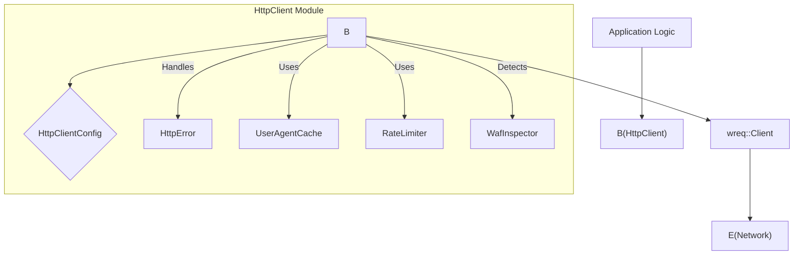

# HTTP Client

# HTTP Client Module

The HTTP Client module provides a robust and configurable HTTP client for making web requests. It wraps the `wreq` crate, enhancing it with features like retry logic, user-agent rotation, TLS fingerprint emulation, rate limiting, and WAF detection. This module is designed to handle the complexities of web scraping by providing a resilient and adaptable way to interact with web servers.

## Purpose

The primary purpose of this module is to abstract away the low-level details of making HTTP requests, offering a higher-level interface that is tailored for web scraping scenarios. It aims to:

*   **Improve Reliability:** Implement retry mechanisms for transient network errors and server-side issues (5xx status codes).
*   **Bypass Detection:** Employ user-agent rotation and TLS fingerprint emulation to mimic real browser traffic and avoid detection by websites.
*   **Manage Load:** Incorporate rate limiting to prevent overwhelming target servers and adhere to their usage policies.
*   **Handle Challenges:** Detect and attempt to mitigate Web Application Firewall (WAF) challenges.
*   **Provide Configuration:** Allow fine-grained control over request parameters, timeouts, and retry behavior.

## Key Components

The HTTP Client module consists of the following core components:

### `HttpClient` Struct

The central struct of this module, `HttpClient`, wraps the underlying `wreq::Client`. It holds the configuration, a pool of user agents, and a rate limiter.

*   **`client: Client`**: The internal `wreq::Client` instance, configured with TLS emulation, default headers, timeouts, and connection pooling.
*   **`config: HttpClientConfig`**: Stores all configurable parameters for the client's behavior, including headers, retry settings, and timeouts.
*   **`user_agents: Vec<String>`**: A collection of user agent strings used for rotation, particularly when encountering 403 Forbidden responses.
*   **`rate_limiter: Option<RateLimiter<NotKeyed, InMemoryState, DefaultClock>>`**: An optional rate limiter instance, configured based on the `rate_limit_rpm` setting in `HttpClientConfig`.

### `HttpClientConfig` Struct

This struct defines the configurable aspects of the HTTP client. It allows users to customize various settings to tailor the client's behavior for specific scraping tasks.

*   **`accept_language`**: Sets the `Accept-Language` header.
*   **`accept`**: Sets the `Accept` header.
*   **`referer`**: Sets the `Referer` header.
*   **`cache_control`**: Sets the `Cache-Control` header.
*   **`max_retries`**: The maximum number of times a request will be retried upon failure.
*   **`backoff_base_ms`**: The base delay in milliseconds for exponential backoff.
*   **`backoff_max_ms`**: The maximum delay in milliseconds for exponential backoff.
*   **`enable_cookies`**: Whether to use a cookie store.
*   **`timeout_secs`**: The overall request timeout in seconds.
*   **`connect_timeout_secs`**: The connection timeout in seconds.
*   **`rate_limit_rpm`**: An optional setting for requests per minute.
*   **`tls_emulation`**: Specifies the TLS fingerprint to emulate (e.g., `Chrome145`, `Chrome131`).

### `HttpError` Enum

This enum defines the possible errors that can occur during HTTP requests. It provides specific variants to help the caller understand the nature of the failure and potentially implement appropriate recovery strategies.

*   **`Forbidden`**: For 403 responses, indicating potential site blocking.
*   **`RateLimited(u64)`**: For 429 responses, including the `retry-after` duration.
*   **`ClientError(u16)`**: For other 4xx client errors.
*   **`ServerError(u16)`**: For 5xx server errors.
*   **`Timeout`**: For request timeouts.
*   **`Connection(String)`**: For connection-related errors.
*   **`Request(String)`**: For errors during request construction or execution.
*   **`WafChallenge(String)`**: For detected WAF or CAPTCHA challenges.

### `HttpResult<T>` Type Alias

A convenience type alias for `Result<T, HttpError>`, simplifying function signatures.

## Core Functionality

### `HttpClient::new(config: HttpClientConfig)`

This constructor creates a new `HttpClient` instance. It initializes the underlying `wreq::Client` with the provided configuration, including:

*   **TLS Emulation**: Configures the client to mimic specific browser TLS fingerprints using `wreq_util::Emulation`.
*   **Default Headers**: Sets standard headers like `sec-ch-ua`, `sec-ch-ua-mobile`, `sec-ch-ua-platform`, `sec-fetch-*`, and `upgrade-insecure-requests` to enhance browser-like behavior.
*   **Timeouts**: Sets both the overall request timeout and the connection timeout.
*   **Connection Pooling**: Configures the maximum number of idle connections per host and their idle timeout.
*   **Compression**: Enables Gzip and Brotli compression.
*   **Cookie Store**: Enables cookie persistence.
*   **Redirect Policy**: Sets a limited redirect policy.
*   **Rate Limiter**: Initializes a `RateLimiter` if `config.rate_limit_rpm` is set.

### `HttpClient::get(url: &str)`

This is the primary method for performing GET requests. It implements the following logic:

1.  **URL Validation**: Parses the URL and ensures it uses `http` or `https` schemes.
2.  **Rate Limiting**: Waits for the rate limiter to be ready if configured.
3.  **Retry Loop**: Enters a loop to handle retries and different error conditions.
    *   **User-Agent Rotation**: Selects a user agent from the pool. If WAF challenges are detected and `ua_index` is within certain bounds, it increments `ua_index` to try different strategies.
    *   **Header Management**: Applies standard headers and conditionally includes `Referer` and `Cache-Control` based on the `ua_index` (to attempt WAF bypass).
    *   **Request Execution**: Sends the request using `self.client.get(url).send().await`.
    *   **Error Handling**: Maps `wreq` errors to `HttpError` variants (e.g., `Timeout`, `Connection`).
    *   **Status Code Handling**:
        *   **2xx**: If the response body is successfully retrieved, it's checked for WAF challenges using `WafInspector::detect_body`. If a challenge is found, it triggers fallback strategies (UA rotation, minimal headers, random delay) or returns `HttpError::WafChallenge`. If no challenge, the body is returned.
        *   **403**: Retries once with a rotated user agent. If it fails again, returns `HttpError::Forbidden`.
        *   **429**: Implements exponential backoff, respecting the `Retry-After` header if present. It retries up to `max_attempts`.
        *   **5xx**: Implements exponential backoff and retries up to `max_attempts`.
        *   **Other 4xx**: Returns `HttpError::ClientError`.
        *   **Other codes**: Returns `HttpError::ServerError`.

### `create_http_client()`

A legacy function that creates a `wreq::Client` with a basic configuration, including a single, randomly selected user agent and Chrome 145 TLS emulation. It's less configurable than `HttpClient::new`.

### `get_random_user_agent_from_pool()`

A utility function to select a random user agent from a provided slice of strings.

## Integration with the Codebase

*   **Configuration**: The `HttpClientConfig` struct is used to configure the client's behavior, often loaded from application settings or defaults.
*   **Error Handling**: `HttpError` and `HttpResult` are used throughout the application to represent and handle network-related failures.
*   **Web Scraping Logic**: The `HttpClient::get` method is the primary interface used by higher-level scraping functions (e.g., in `scraper_service.rs` and `crawler_service.rs`) to fetch web page content.
*   **Testing**: The module includes extensive unit and integration tests, often using `wiremock` to simulate various HTTP responses and test the retry and error handling logic.

## Architecture Overview

The `HttpClient` acts as a middleware layer over `wreq::Client`. It intercepts requests and responses to apply custom logic before passing them to or receiving them from the underlying `wreq` implementation.

