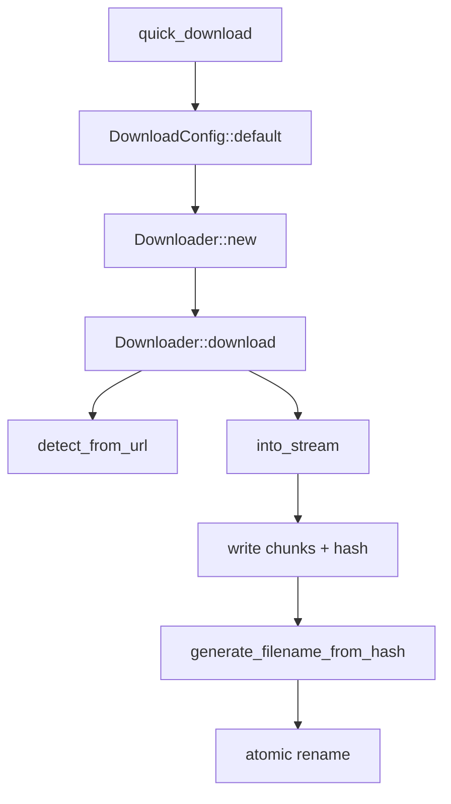
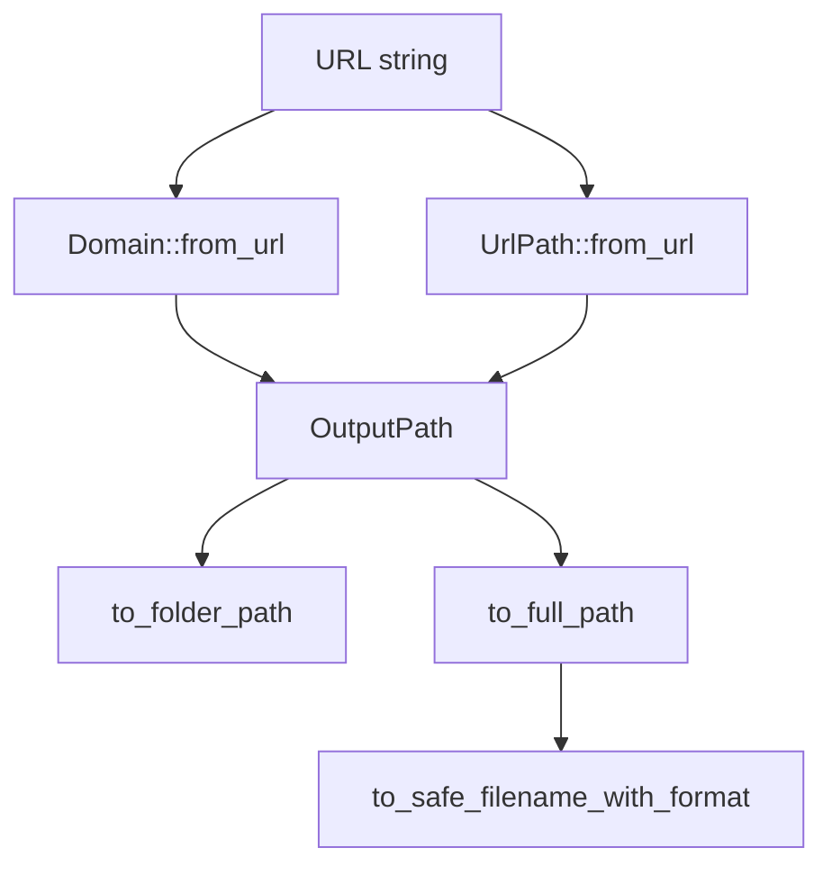

# Infrastructure Adapters

# Infrastructure Adapters

This module contains the infrastructure-facing adapters used by the scraper: network asset downloading, URL/path translation, and re-exports for extraction-related helpers. It sits at the boundary between the core domain logic and external systems such as HTTP clients and the filesystem.

The two most concrete pieces in this snapshot are:

- `adapters::downloader` — streams remote assets to disk with size limits, atomic rename, and MIME-based extensions
- `adapters::url_path` — converts URLs into filesystem-safe output paths, with collision avoidance and Windows reserved-name protection

`src/adapters/mod.rs` also acts as the adapter layer entry point and re-exports selected items from submodules so callers can depend on a smaller surface area.

## Module layout

- `src/adapters/mod.rs`
  - `detector`
  - `downloader`
  - `extractor`
  - `tui`
  - `url_path`

The `mod.rs` file declares the adapter submodules and re-exports:

- `get_extension` and `AssetType` from `detector`
- `get_extension`, `extract_all_assets`, `extract_documents`, `extract_images`, and `AssetUrl` from `extractor`

This makes `crate::adapters` the main integration point for infrastructure concerns.

## Responsibilities

This layer is responsible for:

- downloading assets from remote URLs
- choosing file extensions from MIME types
- building stable, unique, filesystem-safe output names
- preventing platform-specific path issues
- providing convenience wrappers around lower-level adapters

It intentionally avoids owning higher-level scraping logic; instead, it provides the I/O primitives that the rest of the application can compose.

---

## `adapters::downloader`

`src/adapters/downloader/mod.rs` implements a streaming download pipeline that writes assets directly to disk.

### Core types

#### `DownloadedAsset`

Represents the result of a successful download.

Fields:

- `url: String` — original source URL
- `local_path: PathBuf` — final on-disk path
- `mime_type: Option<String>` — response `Content-Type`, if available
- `size: u64` — number of bytes downloaded
- `content_hash: String` — first 12 hex characters of the SHA-256 hash

The hash is computed during streaming and later used to generate the filename.

#### `DownloadConfig`

Configuration for `Downloader`.

Fields:

- `output_dir: PathBuf` — root output directory
- `images_dir: String` — subdirectory for image assets
- `documents_dir: String` — subdirectory for document assets
- `max_file_size: u64` — hard size limit per file
- `timeout_secs: u64` — request timeout
- `concurrency_limit: usize` — batch download concurrency
- `user_agent: String` — HTTP `User-Agent`

`DownloadConfig::default()` sets:

- output directory to `./downloads`
- images directory to `images`
- documents directory to `documents`
- max size to 50 MB
- timeout to 30 seconds
- concurrency limit to 3
- user agent to `WebCrawlerStaticPages/<package-version>`

### `Downloader`

`Downloader` wraps a configured `wreq::Client` plus the download configuration.

#### `Downloader::new(config: DownloadConfig) -> Result<Self>`

Initializes the downloader and pre-creates the asset directories.

What it does:

1. resolves `output_dir/images_dir`
2. resolves `output_dir/documents_dir`
3. creates both directories synchronously with `std::fs::create_dir_all`
4. builds an HTTP client with:
   - `Emulation::Chrome145`
   - configured timeout
   - configured user agent

Important behavior:

- directory creation is done once up front
- client construction failures are mapped into `ScraperError::Config`
- I/O failures become `ScraperError::Io`

This “init once” pattern is deliberate: it removes runtime directory-creation contention from the hot download path.

#### `Downloader::download(&self, url: &str) -> Result<DownloadedAsset>`

Downloads a single asset using a true streaming workflow.

Execution outline:

1. `GET` the URL with `wreq::Client`
2. capture the `Content-Type` header if present
3. classify the URL via `crate::adapters::detector::detect_from_url(url)`
4. choose the destination subdirectory:
   - image assets → `images_dir`
   - everything else → `documents_dir`
5. create a UUID-named temp file in the target subdirectory
6. stream chunks from the response
7. for each chunk:
   - increment byte count
   - reject downloads exceeding `max_file_size`
   - append chunk to disk immediately
   - update the SHA-256 hasher
8. sync and close the temp file
9. finalize the hash
10. generate the final filename from hash + MIME type
11. atomically rename temp file to final file
12. return a populated `DownloadedAsset`

Behavioral details:

- memory usage stays roughly constant because chunks are written directly to disk
- size limits are enforced while streaming, not after the fact
- failed oversized downloads remove the temp file before returning
- final rename is atomic, so consumers never see partial files under the final name

Filename generation uses:

- the first 12 hex characters of the SHA-256 hash
- an extension derived from MIME type when known
- `.bin` as a fallback

#### `Downloader::download_batch(&self, urls: &[String]) -> Vec<Result<DownloadedAsset>>`

Downloads multiple URLs with bounded concurrency.

How it works:

- returns early with an empty vector if `urls` is empty
- turns each URL into an async task calling `self.download(&url)`
- uses `stream::iter(...).buffer_unordered(self.config.concurrency_limit)`
- collects the individual `Result<DownloadedAsset>` values into a `Vec`

This preserves per-item success/failure rather than failing the whole batch at the first error.

#### `Downloader::generate_filename_from_hash(&self, content_hash: &str, mime_type: Option<&str>) -> String`

Creates a stable filename from:

- the first 12 characters of `content_hash`
- a MIME-derived extension

If no MIME type maps cleanly to an extension, the method falls back to `.bin`.

This method is private, but it is central to the module’s collision-resistant naming strategy.

### Helpers

#### `into_stream(response: Response)`

Converts a `wreq::Response` into a byte stream via `response.bytes_stream()`.

This is the adapter point that enables chunk-by-chunk disk writes.

#### `mime_type_to_extension(mime: &str) -> Option<String>`

Maps common MIME types to file extensions.

Supported mappings include:

- image formats:
  - `image/jpeg` / `image/jpg` → `jpg`
  - `image/png` → `png`
  - `image/gif` → `gif`
  - `image/webp` → `webp`
  - `image/svg+xml` → `svg`
  - `image/bmp` → `bmp`
  - `image/tiff` → `tiff`
  - `image/x-icon` → `ico`
- documents and office formats:
  - `application/pdf` → `pdf`
  - `application/msword` → `doc`
  - `application/vnd.openxmlformats-officedocument.wordprocessingml.document` → `docx`
  - `application/vnd.ms-excel` → `xls`
  - `application/vnd.openxmlformats-officedocument.spreadsheetml.sheet` → `xlsx`
  - `application/vnd.ms-powerpoint` → `ppt`
  - `application/vnd.openxmlformats-officedocument.presentationml.presentation` → `pptx`
  - `application/vnd.oasis.opendocument.text` → `odt`
  - `application/vnd.oasis.opendocument.spreadsheet` → `ods`
  - `application/epub+zip` → `epub`
  - `application/rtf` → `rtf`
- text and data formats:
  - `text/csv` → `csv`
  - `text/plain` → `txt`
  - `application/json` → `json`
  - `application/xml` / `text/xml` → `xml`

Unknown types return `None`.

#### `quick_download(url: &str, output_dir: &Path) -> Result<DownloadedAsset>`

A convenience wrapper for one-off downloads.

It:

1. builds a `DownloadConfig` using the provided `output_dir`
2. applies default values for the rest of the config
3. constructs a `Downloader`
4. calls `Downloader::download`

Use this when you need a small, direct API. For production or repeated downloads, construct `Downloader` yourself so you can control size limits, concurrency, and user agent policy.

### Downloader flow

---

## `adapters::url_path`

`src/adapters/url_path.rs` provides type-safe path handling for URL-derived output locations.

Its design avoids “stringly typed” path construction by introducing dedicated newtypes for domain names and URL paths.

### Why this module exists

URL-to-filesystem mapping is deceptively tricky:

- query strings and fragments should not affect the output path
- `/docs` and `/docs/` need consistent behavior
- nested trailing-slash URLs must not collapse into the same `index.md`
- Windows reserved device names must never become filenames
- output paths need to be reproducible and safe across platforms

This module encapsulates those rules.

### `WINDOWS_RESERVED`

A constant slice of Windows reserved device names:

- `CON`
- `PRN`
- `AUX`
- `NUL`
- `COM1` through `COM9`
- `LPT1` through `LPT9`

These are checked case-insensitively when generating filenames.

### `Domain`

A validated domain extracted from a URL.

#### `Domain::from_url(url: &str) -> Result<Self, DomainError>`

Parses the URL and extracts the host.

Behavior:

- rejects invalid URLs
- rejects URLs with no host
- rejects empty hosts
- strips a leading `www.` for consistency

This normalization keeps output folders stable across common host variants.

#### Other `Domain` methods

- `new_unchecked<S: Into<String>>(s: S) -> Self`
  - constructor bypassing validation
  - marked `#[allow(dead_code)]`
- `as_str(&self) -> &str`
- `into_string(self) -> String`

`Domain` also implements `Display`, so it can be formatted directly.

#### `DomainError`

Variants:

- `InvalidUrl(String)`
- `NoHost`
- `EmptyHost`

### `UrlPath`

Represents a normalized path component derived from a URL.

Internal fields:

- `raw: String`
- `is_root: bool`
- `ends_with_slash: bool`

The `ends_with_slash` field is currently tracked during parsing, but the filename generation strategy does not collapse trailing-slash paths into `index.md` except for the root path.

#### `UrlPath::from_url_path(path: &str) -> Self`

Normalizes a raw URL path string.

Steps:

1. strips query string and fragment
2. ensures the path begins with `/`
3. detects the root path
4. tracks whether the original path ended in `/`
5. stores a trailing-slash-trimmed version of the path for later use

#### `UrlPath::from_url(url: &str) -> Result<Self, UrlPathError>`

Parses a full URL and extracts its path portion.

#### `UrlPath::to_safe_filename(&self) -> String`

Generates a unique, filesystem-safe filename using the default output format.

Rules:

- root path → `index.md`
- nested paths are flattened into a single slug using `-`
- spaces become `_`
- invalid path characters are sanitized
- Windows reserved names get a `_safe` suffix
- extension defaults to `.md`

Examples:

- `/` → `index.md`
- `/docs` → `docs.md`
- `/docs/api/` → `docs-api.md`
- `/blog/post1/` → `blog-post1.md`

#### `UrlPath::to_safe_filename_with_format(&self, format: Option<OutputFormat>) -> String`

Same as `to_safe_filename`, but lets callers select the extension via `OutputFormat`:

- `OutputFormat::Json` → `.json`
- `OutputFormat::Text` → `.txt`
- `OutputFormat::Markdown` or `None` → `.md`

#### `UrlPath::to_directory(&self) -> String`

Returns the parent directory portion of the path, without the final component.

Examples:

- `/` → `""`
- `/docs` → `""`
- `/docs/api/` → `"docs/"`

This is used when constructing the final folder hierarchy.

#### `UrlPath::sanitize_path_segment(s: &str) -> String`

Internal sanitizer used during filename generation.

It replaces invalid filesystem characters such as:

- `\`
- `:`
- `*`
- `?`
- `"`
- `<`
- `>`
- `|`
- space

with `_`, while preserving alphanumeric characters and `-`, `_`, `.`.

`UrlPath` also implements `Display` to show the normalized raw path.

#### `UrlPathError`

Currently contains:

- `InvalidUrl(String)`

### `OutputPath`

Combines `Domain` + `UrlPath` into a complete output location.

#### `OutputPath::from_url(url: &str) -> Result<Self, OutputPathError>`

Builds the full output path from a URL.

Process:

1. parse the domain with `Domain::from_url`
2. parse the full URL with `url::Url`
3. extract and normalize the path into `UrlPath`

#### `OutputPath::to_folder_path(&self) -> String`

Produces the directory path under `./output`.

Examples:

- `https://example.com/` → `./output/example.com/`
- `https://example.com/docs/api/` → `./output/example.com/docs/`

#### `OutputPath::to_full_path(&self) -> String`

Produces the full file path using the default markdown format.

Examples:

- `https://example.com/` → `./output/example.com/index.md`
- `https://example.com/docs/api/` → `./output/example.com/docs/docs-api.md`

#### `OutputPath::to_full_path_with_format(&self, format: Option<OutputFormat>) -> String`

Like `to_full_path`, but allows explicit output format selection.

#### `OutputPath::to_pathbuf(&self) -> PathBuf`

Convenience wrapper around `to_full_path()`.

#### `OutputPath::domain(&self) -> &Domain`

Returns the parsed domain.

#### `OutputPath::path(&self) -> &UrlPath`

Returns the parsed URL path.

#### `OutputPath::images_relative_path(&self) -> String`

Builds a relative `images/` folder path for embedded assets.

Examples:

- root pages → `"images/"`
- `/docs/api/` → `"docs/images/"`

This is useful for keeping asset references local to the page folder.

#### `OutputPathError`

Variants:

- `InvalidUrl(String)`
- `Domain(#[from] DomainError)`

### URL path flow

---

## Re-exports and integration points

### `src/adapters/mod.rs`

This module exposes the adapter layer to the rest of the crate:

- `pub mod detector;`
- `pub mod downloader;`
- `pub mod extractor;`
- `pub mod tui;`
- `pub mod url_path;`

It also re-exports:

- `detector::{get_extension, AssetType}`

### `src/adapters/extractor/mod.rs`

This is a thin re-export layer that bridges extraction helpers from the crate root into the adapter namespace:

- `crate::adapters::detector::get_extension`
- `crate::extractor::{extract_all_assets, extract_documents, extract_images, AssetUrl}`

This means code that works with adapter-level concerns can access extraction helpers through `crate::adapters::extractor` without needing to know the original module location.

### Connection to the rest of the codebase

The adapter layer depends on shared crate-level types and services:

- `crate::error::{Result, ScraperError}` for consistent error handling
- `crate::adapters::detector::detect_from_url` to distinguish images from documents
- `crate::OutputFormat` for output-format-aware filename generation
- `crate::extractor::*` via re-export for URL extraction workflows

In practice, the surrounding application can:

- extract asset URLs
- classify them
- download them with `Downloader`
- map pages and assets into stable output paths with `OutputPath`

---

## Testing strategy

The module includes unit tests that validate:

- downloader initialization
- pre-creation of output directories
- config defaults and overrides
- MIME-to-extension mapping
- filename generation from hashes
- empty batch behavior
- domain parsing
- URL path normalization
- output path construction
- Windows reserved-name handling
- collision avoidance for nested and trailing-slash URLs

The tests emphasize behavior that matters for production stability:

- filesystem safety
- deterministic naming
- unique output generation
- safe defaults

## Implementation notes for contributors

- `Downloader::new` creates directories synchronously before the async download path begins. Keep this pattern if you add more asset subdirectories.
- `Downloader::download` is intentionally streaming; avoid introducing buffering that defeats the constant-memory design.
- Any new MIME mappings should be added in `mime_type_to_extension`.
- If you extend URL-to-path behavior, preserve the collision-avoidance guarantees around nested trailing-slash URLs.
- Windows reserved-name handling should remain case-insensitive.
- Prefer returning `Result<T, ScraperError>`-compatible errors in the downloader so callers get consistent failure modes.

## Summary

The infrastructure adapters module provides the code that turns remote resources and URLs into durable local artifacts. `downloader` handles network-to-disk streaming safely and efficiently, while `url_path` guarantees that URL-derived output paths are stable, unique, and filesystem-safe. Together, they form the infrastructure backbone that higher-level scraping logic relies on.