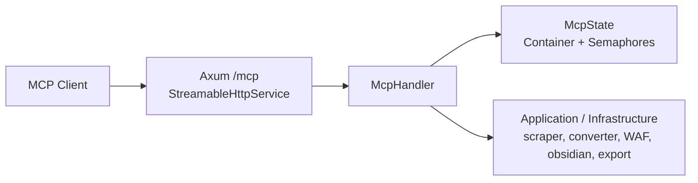

# MCP Server

# MCP Server Module

The `src/infrastructure/mcp_server` module exposes the application as a Model Context Protocol (MCP) server over Streamable HTTP. It bridges AI clients to the scraper/content/export/utility functionality in the rest of the codebase and enforces per-category concurrency limits to keep the server stable on constrained hardware.

The module is split into three parts:

- `state.rs` — shared server state and backpressure controls
- `server.rs` — HTTP transport, Axum router, server startup, and tests
- `handlers/` — tool router composition by feature/category

At the center is `McpHandler`, an MCP `ServerHandler` implementation that owns the application `Container`-backed state and registers 37 tools via `#[tool_router]` and `#[tool]` macros.

---

## Architecture



The request path is:

1. An MCP client connects to `/mcp`.
2. `StreamableHttpService` creates a fresh `McpHandler` using shared `McpState`.
3. `McpHandler` routes the tool call to the correct method generated by `#[tool_router]`.
4. The tool method acquires a category semaphore, validates input, and delegates to lower-level application/infrastructure code.
5. The result is serialized into an MCP `CallToolResult`.

---

## Responsibilities

This module is responsible for:

- exposing application capabilities as MCP tools
- serializing tool input and output according to MCP conventions
- protecting CPU, disk, and network resources through semaphores
- providing a single HTTP endpoint for MCP-compatible clients
- wiring the MCP transport into the application’s dependency injection container

It intentionally does not contain most of the business logic itself. Tool methods mostly act as thin orchestration wrappers around functions in:

- `crate::application::scraper_service`
- `crate::application::crawler_service`
- `crate::infrastructure::converter::*`
- `crate::infrastructure::http::waf_engine`
- `crate::infrastructure::obsidian::*`
- `crate::adapters::url_path`

---

## `McpState` and backpressure

`state.rs` defines the shared state passed into every handler instance.

### `CategoryLimits`

`CategoryLimits` is a per-tool-category concurrency configuration:

- `ai`
- `scraping`
- `export`
- `obsidian`
- `content`
- `url_utils`
- `security`
- `assets`

The defaults are tuned for low-resource environments:

- AI: `2`
- scraping: `8`
- export: `4`
- obsidian: `3`
- content: `6`
- url_utils: `16`
- security: `8`
- assets: `4`

The important design choice is that limits are category-specific, not global. This avoids one expensive operation type starving everything else.

### `CategorySemaphores`

`CategorySemaphores` wraps a `tokio::sync::Semaphore` per category. Tool methods acquire a permit before doing work:

```rust
let _permit = self.state.semaphores.scraping.acquire().await?;
```

This pattern appears throughout the tool implementations and is the main backpressure mechanism in the module.

### `McpState`

`McpState` contains:

- `container: Arc<Container>`
- `limits: Arc<CategoryLimits>`
- `semaphores: Arc<CategorySemaphores>`

`McpState::new(container)` constructs the default limits and semaphores, while `McpState::with_limits(container, limits)` allows tests or callers to override the concurrency profile.

---

## Server startup and transport

`server.rs` provides the HTTP entry point.

### `DEFAULT_MCP_ADDR`

Default bind address:

- `127.0.0.1:8080`

### `build_mcp_router(state: McpState) -> Router`

Builds an Axum router and mounts the MCP service at `/mcp`.

It creates an `rmcp::transport::streamable_http_server::tower::StreamableHttpService` using:

- a handler factory closure: `move || Ok(McpHandler::new(state.clone()))`
- `LocalSessionManager::default()`

This means each session gets a handler instance, but the state itself is shared via `Arc`.

### `start_mcp_server(state, addr)`

Starts the HTTP server:

1. builds the router with `build_mcp_router`
2. binds a `TcpListener`
3. serves the Axum app
4. waits for graceful shutdown via `shutdown_signal()`

### `shutdown_signal()`

Blocks on `tokio::signal::ctrl_c()` and logs shutdown. This keeps the server responsive to `Ctrl+C` without abrupt termination.

---

## `McpHandler`

`McpHandler` is the MCP server implementation.

```rust
#[derive(Clone)]
pub struct McpHandler {
    pub state: McpState,
    pub tool_router: ToolRouter<Self>,
}
```

### Construction

`McpHandler::new(state)` combines:

- `Self::tool_router()` generated from the `#[tool_router]` impl block in this file
- `handlers::build_tool_router()`, which aggregates the category submodules

This architecture leaves room for future modularization while keeping the actual tool definitions centralized today.

### MCP integration

`#[tool_handler] impl ServerHandler for McpHandler {}` generates the protocol-level request handling methods and delegates tool dispatch to `tool_router`.

---

## Tool organization

Tools are grouped into categories that match semaphore limits and conceptual areas of responsibility.

### 1. Scraping Core

Tools:

- `scrape_url`
- `scrape_with_options`
- `scrape_batch`
- `crawl_site`
- `crawl_with_sitemap`
- `discover_urls`
- `discover_sitemap`
- `detect_spa`

These methods mostly:

- acquire `semaphores.scraping`
- validate URL parameters with `url::Url::parse`
- call scraper/crawler services
- serialize structured results to JSON

Common call patterns:

- `crate::application::scraper_service::scrape_with_readability`
- `crate::application::scraper_service::scrape_with_config`
- `crate::application::scraper_service::scrape_multiple_with_limit`
- `crate::application::crawler_service::crawl_site`
- `crate::application::crawler_service::crawl_with_sitemap`
- `crate::application::crawler_service::fetch_sitemap`
- `crate::infrastructure::crawler::extract_links`

`detect_spa` additionally uses:

- `crate::infrastructure::scraper::fallback::extract_text`
- `crate::application::scraper_service::detect_spa_content`

### 2. Content Processing

Tools:

- `clean_html`
- `convert_html_to_markdown`
- `extract_links`
- `highlight_code_blocks`
- `convert_wiki_links`
- `generate_frontmatter`
- `generate_rich_metadata`

These are mostly pure transformations and use `semaphores.content`.

They delegate to:

- `crate::infrastructure::converter::html_cleaner::clean_html`
- `crate::infrastructure::converter::html_to_markdown::convert_to_markdown`
- `crate::infrastructure::crawler::extract_links`
- `crate::infrastructure::converter::syntax_highlight::highlight_code_blocks`
- `crate::infrastructure::converter::wikilinks::convert_wiki_links`
- `crate::infrastructure::output::frontmatter::generate_with_metadata`
- `crate::infrastructure::obsidian::metadata::{compute_word_count, compute_reading_time}`

### 3. Export

Tools:

- `export_file`
- `export_jsonl`
- `export_vector`
- `process_export_pipeline`

These methods are currently mostly orchestration stubs with directory validation and status messages, but they still use `semaphores.export` to protect I/O-heavy operations.

Notable logic:

- `export_file` parses `ExportFormat` via `crate::domain::entities::ExportFormat::parse_str`
- `export_file` ensures the output directory exists with `std::fs::create_dir_all`
- filenames are built using the export format extension

### 4. URL Utilities

Tools:

- `validate_url`
- `extract_domain`
- `normalize_url`
- `match_url_pattern`
- `is_internal_link`
- `url_to_file_path`

These are lightweight and use `semaphores.url_utils`.

They rely on:

- `url::Url::parse`
- `crate::adapters::url_path::OutputPath::from_url`

`validate_url` returns a structured JSON object with the parsed components or error details.

`normalize_url` strips fragments and removes trailing slashes from non-root paths.

`match_url_pattern` is intentionally simple and SSRF-safe in spirit, but the current implementation is a string containment check with `*` support. If you extend it, keep the tool’s contract and security implications in mind.

### 5. Security & Diagnostics

Tools:

- `detect_waf`
- `verify_waf_integrity`
- `list_waf_providers`
- `get_scrape_metrics`

These use `semaphores.security`.

Delegation points:

- `crate::infrastructure::http::waf_engine::WafInspector::detect_body`
- `crate::infrastructure::http::waf_engine::WafInspector::verify_integrity`
- `crate::infrastructure::http::waf_engine::WafInspector::supported_providers`

`get_scrape_metrics` currently returns a placeholder response indicating that live metrics require an active scraping session.

### 6. Obsidian Integration

Tools:

- `detect_obsidian_vault`
- `build_obsidian_uri`
- `open_in_obsidian`
- `search_obsidian`

These use `semaphores.obsidian`.

Delegation points:

- `crate::infrastructure::obsidian::vault_detector::detect_vault`
- `crate::infrastructure::obsidian::uri::build_obsidian_uri`

`open_in_obsidian` shells out to `open` with the generated URI, so it is platform-specific and currently macOS-oriented.

`search_obsidian` is a placeholder that explicitly notes it requires `--features ai` for embedding-based search. The tool exists in the protocol surface, but the semantic implementation is not completed here.

### 7. Asset Management

Tool:

- `download_assets`

This uses `semaphores.assets`.

It validates `base_url` with `url::Url::parse` and returns a queued status message. The actual asset downloading is not yet wired to the scraper service.

### 8. AI

The `handlers/ai.rs` submodule is feature-gated with `#[cfg(feature = "ai")]`, but currently just returns an empty `ToolRouter`.

This is important for future extension:

- the category exists in state and routing
- the semaphore budget exists
- the routing module is ready
- the actual tools are not yet implemented in the submodule

---

## Execution pattern for tools

Most tool methods follow the same structure:

1. acquire a category semaphore
2. validate or parse the request parameters
3. call the relevant service/helper
4. convert the result into `CallToolResult`
5. return `CallToolResult::error(...)` for recoverable failures, or `McpError::invalid_params(...)` for input validation errors

This keeps the transport layer thin and makes tool behavior predictable.

### Common response shapes

The module uses two main MCP response patterns:

- `CallToolResult::success(vec![Content::text(...)])`
- `CallToolResult::error(vec![Content::text(...)])`

JSON is usually pretty-printed before being wrapped in text content.

---

## Handler submodules

`handlers/mod.rs` defines the category-level router composition.

### `build_tool_router()`

Combines the partial routers with `+`:

- `scraping::build_router()`
- `content::build_router()`
- `export::build_router()`
- `url_utils::build_router()`
- `security::build_router()`
- `obsidian::build_router()`
- `assets::build_router()`
- `ai::build_router()`

The submodules currently return empty `ToolRouter::new()` values. Their purpose is structural: they provide a path to split the large `#[tool_router]` impl into smaller files without changing the external interface.

### Important note

`handlers/mod.rs` comments state that all 37 tools are currently defined in the parent `mod.rs` `#[tool_router]` block. That is the effective source of truth for registered tools today.

---

## Tool parameter structs

The module defines request parameter types with `serde::Deserialize` and `schemars::JsonSchema` so MCP clients can infer the input schema.

Examples include:

- `ScrapeUrlParams`
- `ScrapeWithOptionsParams`
- `CrawlSiteParams`
- `CleanHtmlParams`
- `ExportFileParams`
- `ValidateUrlParams`
- `DetectWafParams`
- `BuildObsidianUriParams`

These structs are local to the module and serve as the canonical input schema for the tools.

Patterns to note:

- optional fields are represented as `Option<T>`
- parameter names are descriptive and aligned with the tool descriptions
- many methods reuse smaller parameter structs where the shape overlaps, such as `ValidateUrlParams` for both `validate_url` and `url_to_file_path`

---

## Testing strategy

`server.rs` contains tests for two layers:

### Server assembly

`test_handler_builds_with_all_tools`

- constructs a `Container` with `Config::default()`
- wraps it in `McpState`
- builds `McpHandler`
- checks that the tool router contains the expected tool names

This is the main smoke test for registration integrity.

### Direct logic checks

The rest of the tests call lower-level helpers directly, not the MCP protocol layer, for example:

- URL parsing and normalization
- HTML cleaning and markdown conversion
- WAF detection
- output path conversion
- frontmatter generation
- wiki-link conversion

This is a good model for adding new tests: keep protocol-layer tests focused on router composition and delegate business logic testing to the underlying service/helper module.

---

## Extension guide

When adding a new MCP tool to this module:

1. Define a parameter struct with `Deserialize` and `JsonSchema`.
2. Add a method inside the `#[tool_router] impl McpHandler`.
3. Add a `#[tool(...)]` description that is concise and specific.
4. Acquire the correct category semaphore.
5. Delegate as much logic as possible to a lower-level service/helper.
6. Return `CallToolResult` with clear text or JSON output.
7. If the tool is expensive, ensure its category limit is appropriate in `CategoryLimits`.
8. Add a test that covers either:
   - router registration, or
   - the lower-level logic used by the tool

If you split tools into the `handlers/*` submodules later, keep the `build_tool_router()` aggregation contract intact so `McpHandler::new` continues to register the full set of tools.

---

## Cross-module connections

This module is a transport/orchestration layer that depends on several other parts of the codebase:

- `src/config.rs` — `Config::default()` is used in tests and server assembly
- `src/di.rs` — `Container` provides the shared application services
- `src/application/*` — scraper and crawler workflows
- `src/infrastructure/converter/*` — HTML/Markdown/text transformations
- `src/infrastructure/http/waf_engine.rs` — WAF detection and integrity checks
- `src/infrastructure/obsidian/*` — vault detection, URI generation, metadata
- `src/adapters/url_path.rs` — URL-to-file-path mapping
- `src/domain/*` — URL/crawler/export domain types

The server module’s role is to connect these pieces to the MCP protocol, not to duplicate their logic.

---

## Summary of runtime behavior

At runtime, this module:

- starts an Axum server on `/mcp`
- creates an `McpHandler` per MCP session
- dispatches tool calls through a generated tool router
- protects resource-heavy categories with semaphores
- transforms internal results into MCP text content
- shuts down gracefully on `Ctrl+C`

It is the codebase’s AI-facing integration surface for scraping, content processing, export, URL analysis, security diagnostics, and Obsidian-related workflows.