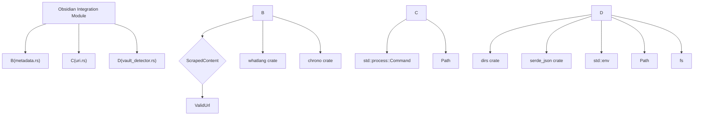

# Obsidian Integration

# Obsidian Integration

This module provides functionality for integrating with Obsidian, a popular knowledge management application. It enables the generation of rich metadata suitable for Obsidian's frontmatter, facilitates the opening of notes directly within Obsidian via its URI scheme, and includes utilities for automatically detecting Obsidian vault locations.

## Key Features

*   **Rich Metadata Generation:** Enhances scraped content with Obsidian-specific metadata like word count, estimated reading time, detected language, and content type.
*   **Obsidian URI Support:** Allows for programmatic opening of notes within an Obsidian vault using the `obsidian://` protocol.
*   **Vault Detection:** Automatically discovers Obsidian vault locations through various methods, simplifying configuration.

## Components

The Obsidian integration is composed of three main sub-modules:

### 1. Metadata Generation (`metadata.rs`)

This sub-module focuses on enriching scraped content with metadata that is particularly useful within Obsidian.

#### `ObsidianRichMetadata` Struct

This struct holds the generated metadata:

*   `word_count`: Total number of words in the content.
*   `reading_time`: Estimated reading time in minutes, calculated at an average of 200 words per minute.
*   `language`: The detected language of the content (ISO 639-1 code), if reliably detected.
*   `content_type`: An inferred type of the content (e.g., "article", "documentation").
*   `scrape_date`: The timestamp when the content was scraped, in ISO 8601 format.
*   `source`: The original URL of the scraped content.
*   `status`: A status field, defaulting to "unread", useful for Obsidian workflows.

#### Core Functions

*   `ObsidianRichMetadata::from_content(scraped: &ScrapedContent) -> Self`: The primary constructor for `ObsidianRichMetadata`. It takes a `ScrapedContent` object and computes all the necessary metadata fields.
*   `compute_word_count(content: &str) -> usize`: Calculates the word count by splitting the input string by whitespace.
*   `compute_reading_time(word_count: usize) -> usize`: Estimates reading time based on word count, rounding up to the nearest minute.
*   `detect_language(content: &str) -> Option<String>`: Uses the `whatlang` crate to detect the language of the text. It samples the beginning of the content for performance and only returns a result if the detection is considered reliable.
*   `detect_content_type(content: &ScrapedContent) -> ContentType`: Infers the type of content based on URL patterns (e.g., `/docs`, `/forum`) and content heuristics (e.g., word count for articles).

#### `ContentType` Enum

An enum to categorize content types: `Article`, `Documentation`, `Forum`, `Product`, and `Other`. It implements `Display` for easy conversion to string representations.

### 2. URI Support (`uri.rs`)

This sub-module handles the creation and opening of Obsidian URIs, allowing direct interaction with the Obsidian application.

#### Core Functions

*   `build_obsidian_uri(vault_name: &str, file_path: &str) -> String`: Constructs a valid `obsidian://open` URI. It uses a custom `encode_obsidian_param` function to ensure that characters critical for URI parsing are encoded, while preserving characters like `/` that Obsidian expects unencoded in file paths.
*   `open_in_obsidian(uri: &str) -> Result<(), String>`: Spawns an external process to open the provided Obsidian URI. It uses platform-specific commands (`xdg-open` on Linux, `open` on macOS, `start` on Windows) and operates in a fire-and-forget manner.
*   `extract_vault_name(vault_path: &Path) -> String`: Extracts the name of the vault from its full path by taking the last directory component.
*   `open_note(vault_path: &Path, file_path: &Path) -> Result<(), String>`: A convenience function that orchestrates the process of opening a note. It combines `extract_vault_name`, `build_obsidian_uri`, and `open_in_obsidian`. It also handles path normalization, including converting Windows path separators and removing the `.md` extension.

#### `encode_obsidian_param` Function

A specialized encoding function that percent-encodes only characters that would break URI parsing (`&`, `=`, `#`, `?`, `%`, `+`, space, and non-ASCII characters), while allowing characters like `/` to remain unencoded, as required by Obsidian URIs.

### 3. Vault Detection (`vault_detector.rs`)

This sub-module provides mechanisms to automatically locate Obsidian vault directories on the user's system.

#### `detect_vault` Function

The main entry point for vault detection. It employs a prioritized search strategy:

1.  **Explicit CLI Path:** Checks if a vault path was provided via a command-line argument (`--vault`).
2.  **Environment Variable:** Looks for a vault path in a configurable environment variable (defaults to `OBSIDIAN_VAULT`).
3.  **Configuration File:** Reads a vault path from a TOML configuration file (`vault_path` field).
4.  **Obsidian Registry:** Parses the official Obsidian registry file (`obsidian.json`) to find the most recently opened vault.
5.  **Auto-Scan:** Scans common locations and the current directory hierarchy for directories containing the `.obsidian/` marker.

#### Helper Functions

*   `is_valid_vault(path: &Path) -> bool`: Determines if a given path points to a valid Obsidian vault by checking for the existence of the `.obsidian/` subdirectory.
*   `scan_common_locations() -> Option<PathBuf>`: Scans the current working directory (up to 3 levels) and common user directories (`~/Obsidian`, `~/Documents/Obsidian`) for vaults.
*   `get_registry_path() -> Option<PathBuf>`: Returns the platform-specific path to the Obsidian registry file (`obsidian.json`).
*   `get_vault_from_registry() -> Option<PathBuf>`: Reads the `obsidian.json` file, parses it, and returns the path to the most recently accessed vault based on its timestamp.

## Module Structure



## Usage Examples

### Generating Metadata

```rust
use your_crate::infrastructure::obsidian::metadata::ObsidianRichMetadata;
use your_crate::domain::ScrapedContent;
use your_crate::domain::ValidUrl;

let scraped_data = ScrapedContent {
    title: "Example Article".to_string(),
    content: "This is the content of the article...".to_string(),
    url: ValidUrl::parse("https://example.com/article").unwrap(),
    // ... other fields
    ..Default::default()
};

let obsidian_metadata = ObsidianRichMetadata::from_content(&scraped_data);

println!("Word Count: {}", obsidian_metadata.word_count);
println!("Reading Time: {} minutes", obsidian_metadata.reading_time);
println!("Language: {:?}", obsidian_metadata.language);
println!("Content Type: {}", obsidian_metadata.content_type);
```

### Opening a Note in Obsidian

```rust
use your_crate::infrastructure::obsidian::uri::{open_note, build_obsidian_uri};
use std::path::Path;

// Assuming you have detected your vault path
let vault_path = Path::new("/path/to/your/Obsidian/Vault");
let note_relative_path = Path::new("Notes/MyImportantNote"); // .md extension is optional

// Using the convenience function
match your_crate::infrastructure::obsidian::uri::open_note(vault_path, note_relative_path) {
    Ok(_) => println!("Attempted to open note in Obsidian."),
    Err(e) => eprintln!("Error opening note: {}", e),
}

// Or building the URI manually
let vault_name = "MyVault"; // Extracted from vault_path
let file_path_str = "Notes/MyImportantNote"; // Normalized path
let obsidian_uri = build_obsidian_uri(vault_name, file_path_str);
println!("Obsidian URI: {}", obsidian_uri);
// Then use open_in_obsidian(&obsidian_uri)
```

### Detecting an Obsidian Vault

```rust
use your_crate::infrastructure::obsidian::vault_detector::detect_vault;
use std::path::Path;

// Example: Prioritize CLI flag, then environment variable, then config file
let cli_vault_path = Some(Path::new("/mnt/data/MyObsidianVault"));
let env_var_name = Some("OBSIDIAN_VAULT_PATH");
let config_vault_path = Some("./config/vault.toml"); // Placeholder

let detected_vault = detect_vault(
    cli_vault_path,
    env_var_name,
    config_vault_path,
);

match detected_vault {
    Some(path) => println!("Detected Obsidian vault at: {}", path.display()),
    None => println!("Obsidian vault not found."),
}
```