# Tests — common

# Tests — common

Shared test fixtures and helpers for integration tests. This module provides utilities for setting up mock HTTP servers, loading HTML fixtures, and generating mock scraped content, ensuring deterministic and isolated testing environments.

## Key Components

### `TestHttpServer`

An RAII wrapper around `wiremock::MockServer` for deterministic HTTP mocking in integration tests. Each instance provides an isolated server, preventing interference between tests.

#### Usage

```rust
#[tokio::test]
async fn test_http_client() {
    let server = common::TestHttpServer::new().await;
    let base_url = server.uri();

    // Register a mock response for a GET request to "/api/test"
    server.mock_response(
        wiremock::matchers::method("GET"),
        "/api/test",
        200,
        r#"{"status":"ok"}"#
    ).await;

    // Use the mock server's base URL with your HTTP client
    // let client = HttpClient::new(&base_url);
    // let response = client.get("test").await;
    // assert!(response.is_ok());
}
```

#### Methods

*   `new()`: Creates and starts a new `MockServer` on an available port.
*   `uri()`: Returns the base URL of the mock server.
*   `mock_response<M>(matcher, path, status, body)`: Registers a custom mock response. `M` must implement `wiremock::matcher::Matcher`.
*   `mock_rate_limit(path)`: Registers a mock that returns a 429 Too Many Requests status.
*   `mock_server_error(path)`: Registers a mock that returns a 500 Internal Server Error status.
*   `mock_not_found(path)`: Registers a mock that returns a 404 Not Found status.

### Fixture Loading

Utilities for accessing test fixture files.

*   `load_fixture(name: &str)`: Loads the content of a file from the `tests/fixtures/` directory. Panics if the file cannot be read.
*   `fixtures_dir()`: Returns the absolute path to the `tests/fixtures/` directory.

### Mock Content Generation

Functions to create mock `rust_scraper::ScrapedContent` objects for testing.

*   `mock_scraped_content(url, title, content)`: Creates a minimal `ScrapedContent` with essential fields.
*   `mock_scraped_content_with_html(url, title, content, html)`: Creates a `ScrapedContent` including the raw HTML.

## Integration with the Codebase

This module is primarily used in integration tests (`tests/`) to simulate external HTTP services and provide realistic data for testing various components, especially the `HttpClient`.

The `TestHttpServer` is crucial for testing scenarios involving API interactions, rate limiting, and error handling without relying on actual external services. Functions like `mock_rate_limit`, `mock_server_error`, and `mock_not_found` directly support testing the resilience and error-handling capabilities of the `HttpClient`.

The fixture loading utilities (`load_fixture`, `fixtures_dir`) are used to provide static HTML content for testing parsing and scraping logic.

The mock content generation functions (`mock_scraped_content`, `mock_scraped_content_with_html`) are used to create test data for components that consume or process scraped web content.

## Call Graph

```mermaid
graph TD
    subgraph "Tests - common"
        A[TestHttpServer] --> B_wiremock__MockServer["B(wiremock::MockServer)"];
        A --> C_uri["C(uri)"];
        A --> D_mock_response["D(mock_response)"];
        A --> E_mock_rate_limit["E(mock_rate_limit)"];
        A --> F_mock_server_error["F(mock_server_error)"];
        A --> G_mock_not_found["G(mock_not_found)"];
        H[load_fixture] --> I_std__fs__read_to_string["I(std::fs::read_to_string)"];
        J[fixtures_dir] --> K_Path__new["K(Path::new)"];
        L[mock_scraped_content] --> M_rust_scraper__ValidUrl__parse["M(rust_scraper::ValidUrl::parse)"];
        N[mock_scraped_content_with_html] --> M;
        O[tests] --> H;
        O --> J;
        O --> L;
    end
    B --> P_wiremock__MockServer__start["P(wiremock::MockServer::start)"];
    D --> Q_wiremock__ResponseTemplate__new["Q(wiremock::ResponseTemplate::new)"];
    D --> R_wiremock__Mock__given["R(wiremock::Mock::given)"];
    R --> S_wiremock__matchers__path["S(wiremock::matchers::path)"];
    E --> D;
    F --> D;
    G --> D;
    M --> T_parse["T(parse)"];
```

