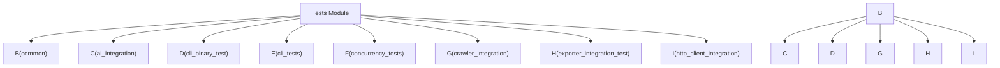

# Tests

# Tests

This module houses all integration and unit tests for the `rust_scraper` crate, ensuring the reliability and correctness of its various components. It is organized into several sub-modules, each targeting specific functionalities and employing different testing strategies.

The `common` sub-module provides essential test fixtures and utilities, such as `TestHttpServer` for mocking HTTP responses and functions for loading HTML fixtures. These are crucial for creating isolated and deterministic testing environments, particularly for integration tests that interact with external services or complex data structures.

The other sub-modules focus on testing distinct aspects of the `rust_scraper` application:

*   **AI Integration:** `ai_integration.rs` verifies the AI-powered semantic cleaning features.
*   **CLI Functionality:** `cli_binary_test.rs` and `cli_tests.rs` test the command-line interface, covering argument parsing and overall binary behavior using `assert_cmd`.
*   **Concurrency:** `concurrency_tests.rs` specifically targets concurrent operations and potential race conditions, ensuring data integrity during parallel processing.
*   **Crawling and HTTP:** `crawler_integration.rs` and `http_client_integration.rs` test the web crawling capabilities and the `HttpClient`'s interaction with external resources, often leveraging `wiremock` for mocking.
*   **Exporting:** `exporter_integration_test.rs` focuses on the `FileExporter`, verifying data integrity and structure across different output formats.

These sub-modules work in concert, with `common` providing the foundational tools for many of the integration tests. Key workflows that span multiple sub-modules include testing the CLI's interaction with the core scraping logic, verifying the `HttpClient`'s behavior under various network conditions (e.g., rate limiting), and ensuring that data is correctly exported after being processed by the crawler and AI features.

