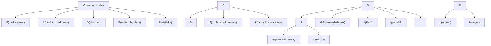

# Text Conversion

# Text Conversion Module

The Text Conversion module provides a suite of tools for transforming raw HTML content into more usable formats, primarily Markdown, with a focus on preserving structure and removing boilerplate. It also includes utilities for enhancing Markdown output, such as syntax highlighting and Obsidian-compatible wiki-link conversion.

## Overview

This module acts as a post-processing layer for scraped HTML content. It aims to clean up HTML by removing navigational elements, scripts, and other non-content-related tags before converting the remaining structure into Markdown. This process is crucial for generating clean, readable, and easily manageable Markdown files, especially for use in knowledge bases like Obsidian.

The core components are:

1.  **HTML Cleaning (`html_cleaner`)**: Removes boilerplate HTML elements and attributes.
2.  **HTML to Markdown Conversion (`html_to_markdown`)**: Converts cleaned HTML into Markdown.
3.  **Obsidian Compatibility (`obsidian`)**: Enhances Markdown for Obsidian, including relative asset path resolution and wiki-link conversion.
4.  **Syntax Highlighting (`syntax_highlight`)**: Applies syntax highlighting to code blocks within Markdown.
5.  **Wiki-link Conversion (`wikilinks`)**: A utility module for converting standard Markdown links to Obsidian's wiki-link format.

## Components

### 1. HTML Cleaner (`html_cleaner`)

**Purpose**: To strip away non-essential HTML elements and attributes that constitute boilerplate, navigation, scripts, styles, and media, leaving behind the core content.

**How it Works**:
This module utilizes the `lol_html` crate, a streaming HTML rewriter. It defines lists of HTML tags (`TAGS_TO_REMOVE`) and CSS selectors (`SELECTORS_TO_REMOVE`) that should be entirely removed along with their content. It also specifies a list of attributes (`PRESERVED_ATTRS`) that should be kept on elements.

The process involves:
*   Iterating through the input HTML string.
*   Applying handlers for each tag and selector to remove matching elements.
*   Applying a general handler to strip all attributes from every element except those in `PRESERVED_ATTRS`.
*   Normalizing whitespace in the resulting HTML to prevent excessive spacing.

**Key Functions**:
*   `clean_html(html: &str) -> String`: The main function that takes raw HTML and returns cleaned HTML.

**Dependencies**:
*   `lol_html`: For efficient, streaming HTML rewriting.
*   `tracing`: For logging errors during the rewriting process.

### 2. HTML to Markdown Conversion (`html_to_markdown`)

**Purpose**: To convert cleaned HTML into well-structured Markdown.

**How it Works**:
This module orchestrates the conversion process by first calling `html_cleaner::clean_html` to prepare the HTML. Then, it uses the `html-to-markdown-rs` crate to perform the actual conversion. Specific conversion options are set to ensure ATX-style headings and fenced code blocks (using backticks).

If the HTML-to-Markdown conversion fails, it falls back to a simpler text extraction method provided by `rust_scraper::infrastructure::scraper::fallback::extract_text`.

**Key Functions**:
*   `convert_to_markdown(html: &str) -> String`: The primary function that takes raw HTML, cleans it, converts it to Markdown, and handles potential errors.

**Dependencies**:
*   `html_to_markdown_rs`: For the core HTML to Markdown conversion.
*   `tracing::warn`: For logging conversion errors.
*   `crate::infrastructure::converter::html_cleaner::clean_html`: To clean the HTML before conversion.
*   `crate::infrastructure::scraper::fallback::extract_text`: For fallback text extraction.

### 3. Obsidian Compatibility (`obsidian`)

**Purpose**: To adapt the generated Markdown for compatibility with Obsidian, focusing on asset path resolution and wiki-link conversion.

**How it Works**:
This module has two main responsibilities:

*   **Relative Asset Paths (`resolve_asset_paths`)**: It takes Markdown content, the intended directory for the output `.md` file, and a list of downloaded assets. It constructs a mapping from original asset URLs to their relative paths from the `.md` file's location. It then uses `pulldown_cmark` to parse the Markdown and rewrite image (``) and other asset references to use these relative paths. This ensures that images and other linked assets are correctly referenced when the Markdown file is moved within an Obsidian vault.
*   **Wiki-link Conversion**: It re-exports functions from the `wikilinks` module (`convert_wiki_links`, `slug_from_url`) to facilitate the transformation of standard Markdown links (`[text](url)`) into Obsidian's wiki-link syntax (`[[slug|text]]`) for same-domain URLs.

**Key Functions**:
*   `resolve_asset_paths(content: &str, md_file_dir: &Path, assets: &[DownloadedAsset]) -> String`: Rewrites asset paths in Markdown to be relative.
*   Re-exports `convert_wiki_links` and `slug_from_url`.

**Dependencies**:
*   `pulldown_cmark`: For parsing Markdown events.
*   `pathdiff`: To calculate relative paths between directories.
*   `std::path::Path`: For path manipulation.
*   `crate::domain::DownloadedAsset`: Represents downloaded assets with their URLs and local paths.
*   `crate::infrastructure::converter::wikilinks`: For wiki-link conversion logic.

### 4. Syntax Highlighting (`syntax_highlight`)

**Purpose**: To apply syntax highlighting to code blocks within Markdown content, converting them into HTML with appropriate `<span>` tags for styling.

**How it Works**:
This module uses the `syntect` crate for syntax highlighting.
*   It pre-loads `SyntaxSet` and `ThemeSet` using `LazyLock` for performance, as these are computationally expensive to initialize. The `base16-ocean.dark` theme is used.
*   A regular expression (`CODE_BLOCK_RE`) is defined to find fenced code blocks (```language\ncode\n```).
*   The `replace_all` method of the regex is used with a closure. For each matched code block:
    *   It identifies the language and the code content.
    *   It attempts to find the corresponding syntax definition in `SYNTAX_SET`.
    *   If found, it generates HTML-highlighted code using `highlighted_html_for_string`.
    *   If the language is unknown or highlighting fails, the original Markdown code block is retained as a fallback.

**Key Functions**:
*   `highlight_code_blocks(markdown: &str) -> String`: Takes Markdown text and returns HTML with highlighted code blocks.

**Dependencies**:
*   `regex`: For pattern matching code blocks.
*   `syntect`: For syntax highlighting logic.
*   `std::sync::LazyLock`: For efficient, one-time initialization of `SyntaxSet` and `ThemeSet`.

### 5. Wiki-link Conversion (`wikilinks`)

**Purpose**: To convert standard Markdown links to Obsidian's wiki-link format (`[[slug|text]]`) for links pointing to the same domain.

**How it Works**:
This module parses Markdown using `pulldown_cmark` and identifies link tags.
*   `slug_from_url`: A helper function that takes a URL path and generates a URL-safe slug by stripping query strings, fragments, trailing slashes, file extensions, and converting the last path segment to lowercase kebab-case. It also handles basic URL decoding.
*   `should_convert_wikilink`: Determines if a given URL should be converted. It checks if the URL is not an anchor, not a relative path, and if its host matches the provided `base_domain`. If these conditions are met, it returns `Some(slug)`; otherwise, `None`.
*   `convert_wiki_links`: The main function that orchestrates the parsing and transformation. It iterates through Markdown events, and when a link is encountered, it calls `should_convert_wikilink`. If a conversion is possible, it formats the output as `[[slug|link_text]]`. Otherwise, it preserves the original Markdown link format.

**Key Functions**:
*   `slug_from_url(url_path: &str) -> String`: Generates a slug from a URL path.
*   `convert_wiki_links(content: &str, base_domain: &str) -> String`: Converts same-domain Markdown links to wiki-links.

**Dependencies**:
*   `pulldown_cmark`: For parsing Markdown events.
*   `url::Url`: For robust URL parsing.

## Module Structure



## Integration with Codebase

*   **`html_cleaner`**: Used by `html_to_markdown` to preprocess HTML.
*   **`html_to_markdown`**: The primary entry point for converting raw HTML scraped from web pages into Markdown. It relies on `html_cleaner`.
*   **`obsidian`**: Used in the final stages of content processing when preparing Markdown files for export to an Obsidian vault. It utilizes `wikilinks` and handles asset path resolution.
*   **`syntax_highlight`**: Applied to Markdown content after it has been generated, typically before final output or saving.
*   **`wikilinks`**: A utility module, primarily used by `obsidian` for its wiki-link conversion feature.

This module forms a critical part of the content processing pipeline, transforming unstructured web data into a structured, usable format.